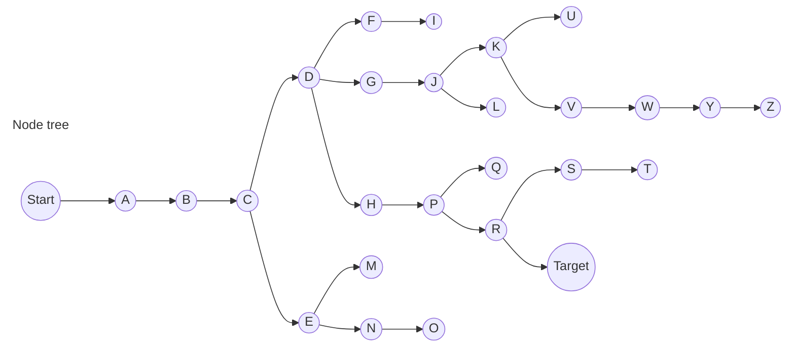

## 序

人工智能(AI)涵盖了一系列以计算机感知行为形式呈现的技术。例如，AI可用于识别社交媒体照片中的人脸、击败国际象棋世界冠军，以及在您通过手机与Siri或Alexa对话时处理您的语音。

在本课程中，我们将探讨一些使人工智能成为可能的想法：

**🔦搜索**

> 找到问题的解决方案，例如导航应用程序可以找到从出发地到目的地的最佳路线，或者玩游戏并找出下一步的动作。

**📖知识**
> 表示信息并从中得出推论。

**❌不确定**
> 使用概率处理不确定事件。

**💻优化**
> 不仅要找到解决问题的正确方法，还要找到解决问题的更好或最佳方法。

**✏️学习**
> 基于数据和经验的访问来提升性能。例如，您的电子邮件能够根据以往的经验区分垃圾邮件和非垃圾邮件。

**🧠神经网络**

> 一种受人脑启发的能够有效执行任务的程序结构。

**👄语言**

> 处理人类产生和理解的自然语言。


---

## 🔦搜索

### 📱搜索的概念

搜索问题涉及一个代理，该代理被赋予初始状态和目标状态，并返回如何从初始状态到达目标状态的解决方案。导航应用采用典型的搜索流程，其中代理(程序的思考部分)接收您的当前位置和期望目的地作为输入，并根据搜索算法返回建议路径。然而，搜索问题还有许多形式，例如谜题或迷宫。


要找到如图pazzle的解决方案，需要使用搜算法

这里有几个概念需要提及，也是解决搜索问题的关键因素：
- **代理**
  > 感知环境并根据环境采取行动的实体。例如，在导航应用中，代理可以表示为一辆汽车，它需要决定采取哪些行动才能到达目的地。

- **状态**
  > 代理在其环境中的配置。例如，在上图的pazzle中，状态是指所有数字在棋盘上的任意一种排列方式。
  >> 初始状态就是搜索算法开始时候的状态。在导航应用中，该状态应该对应到当前的地理位置。

- **行动**
  > 在某个状态下可以做出的选择。更准确地说，动作可以定义为一个函数。在接收状态s作为输入后，返回在s状态下所有可能被执行的下一步动作Actions(s)作为output。

- **转换模型**
  > 对任意状态下执行任何适用操作所导致的状态的描述。更准确地说，转换模型可以定义为一个函数。在接收状态s和动作a作为输入后，返回在一个新的状态，这个状态是Result(s, a)，也就是s状态执行了a动作以后成为的新状态。

- **状态空间**
  > 从初始状态通过任意动作序列可到达的所有状态的集合。

- **目标测试**
  > 确定给定状态是否为目标状态的条件。例如，在导航应用中，目标测试是代理的当前位置(代表了汽车当前的地理位置)是否位于目的地。如果是，则问题解决。如果不是，则继续搜索。

- **路径成本**
  
  > 与给定路径相关的数值成本。例如，导航应用并非简单地将您带到目标位置，而是在最小化路径成本的同时，找到让您以最快速度到达目标位置的路径。


---

### 🧠解决搜索问题

- **解决方案**
  
  > 从初始状态到目标状态的一系列动作。
  
- **最优解**
  > 所有解决方案中路径成本最低的方案。

在搜索的过程中，数据通常存储在**节点**(node)中，该数据结构包含以下数据：

- 一个状态。
- 其父节点，也就是当前节点是通过父节点生成的。父节点通常用于回溯。
- 应用与父节点状态以到达当前节点的操作。
- 从初始状态到达该节点的路径成本。

> 节点包含的信息使其在搜索算法中非常有用。它们包含一个状态，可以使用目标测试来检查它是否是最终状态。如果是，则可以将该节点的路径成本与其他节点的路径成本进行比较，从而选择最优解。一旦选择了节点，通过存储父节点以及从父节点到当前节点的操作，就可以追溯从初始状态到该节点的每一步，而这一系列操作就是解决方案。

> 然而，节点仅仅是一个数据结构，它们不用与搜索，它们保存信息。为了真正地进行搜索，我们使用**边界**(frontier)，即管理节点的机制。frontier首先包含一个初始状态和一个空的已探索项集合，然后重复一下步骤，直到找到解决方案：

```python
1. if frontier == 空：
        停下来，问题还没有解决方案。

2. 从frontier移除一个节点。该节点将会被考虑。

3. if 节点包含目标状态: 
        返回解决方案，然后停止执行。
   else:
        扩展节点(查找可从该节点到达的所有新节点)
        将生成的节点添加到frontier。
        将当前节点加入到已探索集合中。
```

在先前对frontier的描述中，有一件事没有提到。在上面伪代码的第二阶段，应该移除哪个节点？这个选择会影响解决方案的质量及其实现速度。关于应该首先考虑哪些节点的问题，有多种方法，其中两种可以用数据结构来表示：**堆栈**(Stack，用于DFS深度优先搜索)，**队列**(Queue，用于BFS广度优先搜索)


---

#### 📍深度优先搜索(DFS)

> 深度优先搜索算法会先穷尽每个方向，然后再尝试其他方向。在这种情况下，frontier将以**堆栈**数据结构的形式进行管理。这里需要记住的关键词是<u>**后进先出**</u>。将节点添加到frontier后，第一个要移除并考虑的节点是最后一个添加的节点。这使得搜索算法在第一个阻碍其前进的方向上尽可能深入，同时将所有其他方向留待以后再尝试。

- 优点：
  - 如果“运气”足够好，总是能够偶然得选择到正确得路径，那么这种算法是最快得，可以用最少得时间找到解决方案。
- 缺点：
  - 找到的解决方案可能不是最优解。
  - 最糟糕的是，如果运气最够坏，该算法会在找到解决方案之前探索所有可能的路径，从而花费最长的时间才能找到解决方案。

**代码示例：**

```python
# Define the function that removes a node from the frontier and returns it.
def remove(self):
    # Terminate the search if the frontier is empty, because this means that there is no solution.
    if self.empty():
        raise Exception("empty frontier")
    else:
        # Save the last item in the list (which is the newest node added)
        node = self.frontier[-1]
        # Save all the items on the list besides the last node (i.e. removing the last node)
        self.frontier = self.frontier[:-1]
        return node
```


> 如上图所示，到了节点C的时候，会添加frontier[D, E], 然后remove frontier，会移除E，去检查E是不是目标，不是的话会把E的frontier添加进来，变成了frontier[D, M, N]，继续下去，stack后进先出，remove N from frontier，检查N的frontier然后添加变成frontier[D, M, O]，remove节点O，O没有frontier了，返回去remove M节点。M也没有frontier了，再返回去remove D节点，然后把D的frontier F，G， H添加进去。重复这一个过程，直到找到Target。

下图描述了一个DFS算法是如何进行搜索的

```mermaid
flowchart TD
  subgraph Stack[DFS frontier status change]
    step1["Step 1: frontier = [C]"] --> |remove C, and add D,E| step2["Step 2: frontier = [D, E]"]
    step2 --> |remove E, not target, then add M, N| step3["Step 3: frontier = [D, M, N]"]
    step3 --> |remove N, not target, then add O| step4["Step 4: frontier = [D, M, O]"]
    step4 --> |remove O, not target and has no frontiers| step5["Step 5: frontier = [D, M]"]
    step5 --> |remove M, not target, and has no frontiers| step6["Step 6: frontier = [D]"]
    step6 --> |remove D, not target, then add F,G,H| step7["Step 7: frontier = [F, G, H]"]
  end
```




---

#### 📌广度优先算法(BFS)

> 深度优先搜索DFS的对立面是广度优先搜索(BFS)
>
> 广度优先搜索算法会同时追踪多个方向，在每个可能的方向上迈出一步，然后再在每个方向上迈出第二部。在这种情况下，frontier被管理为**队列**数据结构。这里需要记住的口号是**<u>先进先出</u>**。在这种情况下，所有新节点都会按队列添加，并且会根据哪个节点最先添加来进行考虑(先到先得)。这会导致搜索算法在每个可能的方向上迈出一步，然后在任何一个方向上迈出第二步。

- 优点：
  - 该算法保证找到最优解。
- 缺点：
  - 该算法几乎肯定会比最短运行时间花费更长的时间。
  - 最糟糕的情况是，该算法需要最长的时间来运行。

代码示例：

```python
# Define the function that removes a node from the frontier and returns it.
def remove(self):
    # Terminate the search if the frontier is empty, because this means that there is no solution.
    if self.empty():
        raise Exception("empty frontier")
    else:
        # Save the oldest item on the list (which was the first one to be added)
        node = self.frontier[0]
        # Save all the items on the list besides the first one (i.e. removing the first node)
        self.frontier = self.frontier[1:]
        return node
```


还是参考图"Node tree"，我们来看看BFS的搜索过程是怎么样的：

```mermaid
flowchart TD
  subgraph Stack[BFS frontier status change]
    step1["Step 1: frontier = [C]"] --> |remove C, and add D,E| step2["Step 2: frontier = [D, E]"]
    step2 --> |remove D, not target, then add F,G,H| step3["Step 3: frontier = [E,F,G,H]"]
    step3 --> |remove E, not target, then add M, N| step4["Step 4: frontier = [F,G,H,M,N]"]
    step4 --> |remove F, not target, then add I| step5["Step 5: frontier = [G,H,M,N,I]"]
    step5 --> |remove G, not target, then add J| step6["Step 6: frontier = [H,M,N,I,J]"]
    step6 --> |remove H, not target, then add P| step7["Step 7: frontier = [M,N,I,J,P]"]
  end
```




---

#### 🎈贪婪最佳优先搜索(GBF)

> 广度优先和深度优先都是无信息搜索算法。也就是说，这些算法不会利用任何自身探索未获得的知识。然而，大多数情况下，关于问题的知识实际上是可以利用的。例如，当人类迷宫求解器进入交叉路口时，人类能够判断哪条路通向解决方案的大致方向，哪条路则不然。人工智能也能做到这一点。一种考虑额外知识以尝试提升性能的算法被称为有信息搜索算法。
>
> **贪婪最佳优先**(Greedy Best-First)搜索会扩展最接近目标的节点，该节点由启发式函数h(n)确定。顾名思义，该函数会估计下一个节点与目标的距离，但可能会出错。贪婪最佳优先算法的效率取决于启发式函数的优劣。例如，在迷宫中，算法可以使用依赖于可能节点与迷宫末端之间的<u>曼哈顿距离</u>的启发式函数。曼哈顿距离忽略墙壁，只计算从一个位置到目标位置需要上下或者向侧面走多少步。这是一个简单的估计，可以根据当前距离和目标位置的(x, y)坐标推导出来。

**曼哈顿距离：**


然而，需要强调的是，与任何启发式算法一样，它也可能出错，导致算法运行速度比原本更慢。无信息搜索算法或许能够更快地提供更好的解决方案，但其可能性不如有信息算法。


---

#### :star:A*搜索

> A*搜索是贪婪最佳优先算法的扩展，它不仅考虑h(n)(`从当前位置到目标的估计成本`)，还考虑g(n)(`到达当前位置之前积累的成本`)。通过结合这两个值，该算法可以更准确地确定解决方案的成本，并随时优化其选择。该算法会追踪(h(n) + g(n))，一旦该成本超过某个先前选项的估计成本，算法就会放弃当前路径并返回到先前的选项，从而避免走上一条被h(n)错误地标记为最佳的但是却长而低效的路径。
>
> 再次强调，由于该算法也依赖于启发式算法，因此其性能与其所采用的启发式算法一样好。在某些情况下，它的效率可能低于*贪婪的最佳优先*搜索算法，甚至*低于无信息*算法。为了使*A\* 搜索*达到最优，启发式函数*h(n)*应该是：
>
> 1. *可接受的*，或者永远不会*高估*真实成本，并且
> 2. *一致性*，这意味着到达新节点目标的路径成本估计值加上从前一个节点过渡到该节点的成本，大于或等于到达前一个节点目标的路径成本估计值。用方程形式表示，如果对于每个节点*n*及其后继节点*n'* ，步长成本为*c*，则*h(* *n)*是一致的。


---

#### :fist_oncoming:对抗性搜索

> 之前我们讨论的是需要找到问题答案的算法，而在对抗性搜索中，算法面对的是试图实现相反目标的对手。在井字等游戏中，我们经常会遇到使用对抗搜索的人工智能。


##### 🎏极小极大值(Minimax)

>  极小化极大算法是对抗搜索中的一种算法，它将获胜条件表示为一方得分为(-1), 另一方得分为(+1)。后续行动将由这些条件驱动，最小化方试图获得最低分数，而最大化方则试图获得最高分数。


一个代表性的游戏，井字游戏(tic-tac-toe)AI：

- S₀：初始状态(在我们的例子中，是一个空的 3X3 板)
- 玩家：一个函数，给定状态s，返回现在是哪个玩家的回合(X或者O)
- 动作：给定状态s的函数，返回该状态下的所有合法移动(棋盘上哪些位置是空闲的)。
- Result(s, a)： 给定状态s和动作a，返回一个新状态的函数。新状态是在状态s上执行动作a(即在游戏中移动一步)后生成的棋盘。
- 终结函数(Terminal(s))：给定状态s，检查当前是否为游戏的最后一步，即是否有一方获胜或出现平局。如果游戏结束，返回True，否则返回False。
- 效用：给定终结状态s的函数，返回该状态的效用值：-1，0 或者 1。

**算法的工作原理：**

该算法递归地模拟从当前状态开始直到达到终止状态的所有可能发生的游戏。每个终止状态的值均为-1，0或 1。


从上图可以看到，不管有多少个分支，每个分支如何发展，最终都会到达终止状态，得到一个效用值。这样利用Minimax算法就可以向上反推每个状态的效用值。

决定每个状态最终的效用值，是看每个状态执行的玩家，是min玩家还是max玩家。min玩家总是想得到最低的分数，而反之，max玩家总是想得到最高的分数。


**井字游戏中的极小极大算法：**

根据当前轮到哪位玩家的状态，算法可以判断当前玩家在最佳情况下会选择导致状态值较低还是较高的动作。这样，算法在最小化和最大化之间交替，为每个可能的动作创建状态值。举一个更具体的例子，我们可以想象最大化玩家在每个回合都会问：“如果我采取这个动作，将会产生一个新的状态。如果最小化玩家以最佳方式进行游戏，该玩家可以采取什么动作来使状态值最低？” 然而，要回答这个问题，最大化玩家必须问：“要知道最小化玩家会做什么，我需要在最小化玩家的脑海中模拟相同的过程：最小化玩家会尝试问：‘如果我采取这个动作，最大化玩家可以采取什么动作来使状态值最高？’” 这是一个递归过程，可能很难理解；查看下面的伪代码可能会有所帮助。最终，通过这个递归推理过程，最大化玩家会为每个状态生成当前状态下所有可能动作可能产生的值。获得这些值后，最大化玩家会选择最高的那个。


最大化者考虑未来状态的可能值：


绿色向上的箭头代表max玩家，红色向下箭头代表min玩家。现在轮到max玩家下棋，根据倒推，他已经知道了他接下来可能会执行的三个动作的分数是多少，他会在这三个分数里面选择一个最大的值，因为他是max玩家。下面的三个动作得分分别是5，3和9，那这三个值又是怎么来的？同样的，比如第一个红色箭头得分是5，这是红色箭头5这个地方的min玩家在他接下来可能会执行的动作分支里面，选择的得分最小的一个。

总结一下，就是min玩家的每个动作都会选择得分最小的，而他的上一个动作执行者也就是max玩家，只能在min玩家选的分数最小的动作里面，选一个最大分数。

反之亦然。


用伪代码表示，Minimax算法的工作方式如下：

```python
Given a state s

The maximizing player picks action a in Actions(s) that produces the highest value of Min-Value(Result(s, a)).
The minimizing player picks action a in Actions(s) that produces the lowest value of Max-Value(Result(s, a)).

def Max-Value(state):
	v = -∞
	if Terminal(state):
		return Utility(state)

	for action in Actions(state):
		v = Max(v, Min-Value(Result(state, action)))
        return v

def Min-Value(state):
	v = ∞
	if Terminal(state):
        return Utility(state)

    for action in Actions(state):
        v = Min(v, Max-Value(Result(state, action)))
        return v
```


###### ✂️Alpha-Beta剪枝(Alpha-Beta Pruning)

> Alpha-Beta 剪枝是一种优化Minimax的方法，它跳过了一些明显不利的递归计算。在确定一个动作的价值后，如果有初步证据表明下一个动作可以使对手获得比已确定动作更好的分数，则无需进一步研究该动作，因为它显然比先前确定的动作更不利。


用一个例子可以很容易地说明这一点：追求最大化的玩家知道，在下一步中，追求最小化的玩家将尝试获得最低分数。假设追求最大化的玩家有三个可能的动作，第一个动作的值为 4。然后玩家开始为下一个动作生成值。为此，如果当前玩家做出此动作，玩家会生成最小化器动作的值，并且知道最小化器会选择最低的值。但是，在完成最小化器所有可能动作的计算之前，玩家会看到其中一个选项的值是 3。这意味着没有理由继续探索追求最小化的玩家的其他可能动作。尚未赋值的动作的值并不重要，无论是 10 还是 (-10)。如果价值为 10，最小化者会选择最低的选项 3，这已经比预设的 4 更糟糕了。如果尚未赋值的动作最终结果是 (-10)，最小化者会选择这个选项 (-10)，这对最大化者来说更加不利。因此，此时为最小化者计算其他可能的行动对最大化者来说无关紧要，因为最大化者已经有一个毫无疑问更好的选择，其价值为 4。

下图灰色的枝都应该被砍掉，没有必要继续去探索它的值。在复杂的计算中，砍掉尽可能多的枝叶，会节省大量计算时间。


###### 📐**深度限制的极小极大值**

井字棋共有 255,168 种可能的玩法，国际象棋则有 10²⁹⁰⁰⁰ 种可能的玩法。目前为止，极小极大算法需要生成从某个点到最终条件的所有假设玩法。虽然计算所有井字棋玩法对现代计算机来说并不难，但用国际象棋来计算所有玩法目前是不可能的。

**深度受限的极小极大算法**在停止前仅考虑预定数量的移动，而不会达到终止状态。然而，由于假设的游戏尚未结束，因此无法为每个动作获取精确的值。为了解决这个问题，*深度受限的极小极大算法*依赖于一个**评估函数**，该函数从给定状态估计游戏的预期效用，或者换句话说，为状态赋值。例如，在国际象棋游戏中，效用函数会将棋盘的当前配置作为输入，尝试评估其预期效用（基于每个玩家拥有的棋子及其在棋盘上的位置），然后返回一个正值或负值，以表示棋盘对一个玩家相对于另一个玩家的有利程度。这些值可用于决定正确的动作，并且评估函数越好，依赖于它的极小极大算法就越好。
