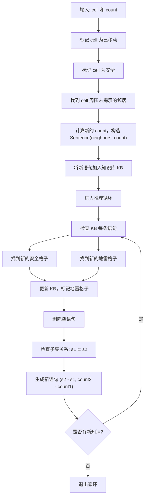

## 序

根据课程学习到的知识，我们需要把现实中遇到的问题表达为知识并存入知识库中。然后根据游戏规则对知识库进行逻辑推理，不断地生成新知识并找到我们想要的答案。


## 题目要求

游戏规则：

- 方格中随机布置地雷
- 打开一个格子后显示**周围**多少个地雷

作业目标：实现一个智能代理 `MinesweeperAI`，能通过推理来决定安全的格子和地雷位置，由此来决定下一步的移动。

## 题目分析

- 扫雷的游戏棋盘可以由一个二维列表实现，棋盘上的每一个小格子，对应的就是棋盘上的一个二维坐标(行号，列号)。

- 知识表示：
  - 用{A, B, C}，count来表示A，B，C三个小方格内，其中有count个是地雷。这也是我们打开一个格子以后能够获取到的唯一知识
  - 随着我们打开越来越多的方格，我们的知识库会不断地添加新知识
- 推理
  - 如果我们点开一个格子，这个格子周围有5个格子，我们得到了一个这样的知识：{A,B,C,D,E}, 0，那说明这5个格子都是安全的格子。我们可以把这5个格子都标记为“安全”。`len(cells) == 0`
  - 同理，如果{A,B,C,D,E}, 5则说明了这5个格子全是地雷，我们同样可以标记这5个格子为“地雷”。`len(cells) == count`
  - 如果`len(cells)`不为零也不为count，我们推理不出任何东西
  - 如果KB里面有这样两条知识：[((A,B,C,D,E), 2), ((A,B,C), 1)]。说明ABC里面有1个雷，ABCDE里面有2个雷，那么我们很容易就可以想到DE里面有一个雷`((D, E), 1)`。所以，只要set2是set1的子集，我们可以通过子集和count的差得到新知识：`((set1 - set2), (count1 - count2))`
- 随着知识的添加，我们能够推导出更多的知识，找到更多标记的“安全”和“地雷”的格子。一旦发现了新的“安全”或者地雷，我们应该及时更新我们的知识库，知识库的变化很大可能让我们能够推导出更多知识。
  - 还是举个例子，`((A,B,C), 2)`，我们知道ABC里面有两个是地雷。接下来我们得到了一条新知识“A是地雷”，我们就应该更新我们的知识库里面的知识，变为`((B,C), 1)`。那如果我们得到的信息是“A是安全的”，对应地知识库应该更新为`((B,C), 2)`，我们就知道了B和C都是地雷。
  - 确定了一个格子是“安全”或者“地雷”，知识库里面的每条描述了这个格子的知识都应该得到更新。我们的知识库里面应该只包含未被标记的格子。
- 我们会保存已经探索过的格子，已知是地雷的格子和已知是地雷的格子。下一步的移动，应该从已知是安全的格子set里面随机地选择一个，如果这个set为空，我们不得不需要随机选择一个为探索过的格子。所以运气不好的话，AI玩家也会输，尤其是在游戏前期，没有获得足够知识而不得随机选择格子移动。




## 核心实现

核心函数add_knowledge是这个题目最大的难点。难度在于如何管理并更新KB。每一次的移动格子，都会带来新的信息，而这些信息需要被正确得存储，合并，甚至简化，而新信息带来的知识库的更新，也会导致我们可以推理出更多的信息

我们来分析add_knowledge函数的功能。

- 当选择了一个方格进行移动，我们会获得这个方格周围有多少个地雷的信息，这个方格的坐标和和它周围的地雷count会作为参数传入add_knowledge函数
- 在函数内，我们需要把参数转化为知识表示，存入我们的KB。具体点说，就是根据参数方格的坐标，找到它周围的其他的未走过的方格的坐标，然后和count一起作为一条knowledge输入到知识库
- 知识库有了更新，所以我们需要循环地对知识库中的语句进行推理。推理的原则在**题目分析**中已经详细给出。
- 随着推理的进行，知识库中会产生更多的知识语句，也会推导出更多的“安全”和“地雷”方格。标记安全和地雷方格，又会更新我们知识库中相关联的语句。从而又产生新的语句，和空的语句。
- 我们需要维护知识库，添加，更新，删除(空语句)知识库中的内容。只要我们可以推导出新的语句，或者任何有更改了知识库的行为，我们就应该继续推导，直到推到不出新语句，知识库不再不被更新。


## 代码实现

代码如下，加了详细注释

```python
import itertools
import random


class Minesweeper():
    """
    Minesweeper game representation
    """

    def __init__(self, height=8, width=8, mines=8):

        # Set initial width, height, and number of mines
        self.height = height
        self.width = width
        self.mines = set()

        # Initialize an empty field with no mines
        self.board = []
        for i in range(self.height):
            row = []
            for j in range(self.width):
                row.append(False)
            self.board.append(row)

        # Add mines randomly
        while len(self.mines) != mines:
            i = random.randrange(height)
            j = random.randrange(width)
            if not self.board[i][j]:
                self.mines.add((i, j))
                self.board[i][j] = True

        # At first, player has found no mines
        self.mines_found = set()

    def print(self):
        """
        Prints a text-based representation
        of where mines are located.
        """
        for i in range(self.height):
            print("--" * self.width + "-")
            for j in range(self.width):
                if self.board[i][j]:
                    print("|X", end="")
                else:
                    print("| ", end="")
            print("|")
        print("--" * self.width + "-")

    def is_mine(self, cell):
        i, j = cell
        return self.board[i][j]

    def nearby_mines(self, cell):
        """
        Returns the number of mines that are
        within one row and column of a given cell,
        not including the cell itself.
        """

        # Keep count of nearby mines
        count = 0

        # Loop over all cells within one row and column
        for i in range(cell[0] - 1, cell[0] + 2):
            for j in range(cell[1] - 1, cell[1] + 2):

                # Ignore the cell itself
                if (i, j) == cell:
                    continue

                # Update count if cell in bounds and is mine
                if 0 <= i < self.height and 0 <= j < self.width:
                    if self.board[i][j]:
                        count += 1

        return count

    def won(self):
        """
        Checks if all mines have been flagged.
        """
        return self.mines_found == self.mines


class Sentence():
    """
    Logical statement about a Minesweeper game
    A sentence consists of a set of board cells,
    and a count of the number of those cells which are mines.
    """

    def __init__(self, cells, count):
        self.cells = set(cells)
        self.count = count

    def __eq__(self, other):
        return self.cells == other.cells and self.count == other.count

    def __str__(self):
        return f"{self.cells} = {self.count}"

    def known_mines(self):
        """
        Returns the set of all cells in self.cells known to be mines.
        """
        # if count equels number of cells, means all of them are mines
        # then return the mine sets, otherwize, we are not sure which ones
        # are mines, which ones are not, so should return empty set.
        if self.count > 0 and len(self.cells) == self.count:
            return set(self.cells)
        else:
            return set()

    def known_safes(self):
        """
        Returns the set of all cells in self.cells known to be safe.
        """
        # if count equels 0, means no mines in those cells, so return cells
        # as known safes. if we are not sure, return empty set.
        if self.count == 0:
            return set(self.cells)
        else:
            return set()

    def mark_mine(self, cell):
        """
        Updates internal knowledge representation given the fact that
        a cell is known to be a mine.
        """
        # In a given sentence's cells set, if we know which one is a mine,
        # we can remove the cell in the sentence's cells set, and decrease count by one,
        # because we removed a mine
        if cell in self.cells:
            self.cells.remove(cell)
            self.count -= 1

    def mark_safe(self, cell):
        """
        Updates internal knowledge representation given the fact that
        a cell is known to be safe.
        """
        # Just remove the cell in the sentence's cells set, no need to change count since count
        # represents counter of mines
        if cell in self.cells:
            self.cells.remove(cell)


class MinesweeperAI():
    """
    Minesweeper game player
    """

    def __init__(self, height=8, width=8):

        # Set initial height and width
        self.height = height
        self.width = width

        # Keep track of which cells have been clicked on
        self.moves_made = set()

        # Keep track of cells known to be safe or mines
        self.mines = set()
        self.safes = set()

        # List of sentences about the game known to be true
        self.knowledge = []

    def mark_mine(self, cell):
        """
        Marks a cell as a mine, and updates all knowledge
        to mark that cell as a mine as well.
        """
        self.mines.add(cell)
        for sentence in self.knowledge:
            sentence.mark_mine(cell)

    def mark_safe(self, cell):
        """
        Marks a cell as safe, and updates all knowledge
        to mark that cell as safe as well.
        """
        self.safes.add(cell)
        for sentence in self.knowledge:
            sentence.mark_safe(cell)

    def add_knowledge(self, cell, count):
        """
        Called when the Minesweeper board tells us, for a given
        safe cell, how many neighboring cells have mines in them.

        This function should:
            1) mark the cell as a move that has been made
            2) mark the cell as safe
            3) add a new sentence to the AI's knowledge base
               based on the value of `cell` and `count`
            4) mark any additional cells as safe or as mines
               if it can be concluded based on the AI's knowledge base
            5) add any new sentences to the AI's knowledge base
               if they can be inferred from existing knowledge
        """
        # mark the cell as a move that has been made
        self.moves_made.add(cell)
        # mark the cell as safe
        self.mark_safe(cell)

        neighbors = set()
        new_count = count

        # Loop over all cells within one row and column, 3 * 3, cell in the middle, then we can find neighbors.
        for i in range(cell[0] - 1, cell[0] + 2):
            for j in range(cell[1] - 1, cell[1] + 2):
                # self cell is not neighbor
                if (i, j) == cell:
                    continue
                # Update count if cell in bounds and is mine, if we're not sure(not mine but not in safes neither), we add neighbors
                if 0 <= i < self.height and 0 <= j < self.width:
                    if (i, j) in self.mines:
                        new_count -= 1
                    elif (i, j) not in self.safes:
                        neighbors.add((i, j))
        
        # Now we got unrevealed neighbors set of current cell, and also how many mines within the neighbors, then we
        # add the new sentence in the KB
        if neighbors:
            new_sen = Sentence(neighbors, new_count)
            self.knowledge.append(new_sen)
        
        # Loop our KB and infer new knowledges. Whenever there are any changes,
        # whether in the KB or in the marked safe or marked mine sets, we should
        # continue to infer the KB from the beginning, since the new knowledge
        # together with the old knowledge may lead to further new inferences.
        # Algorithm:
        # 1. Can we find any safes set in the sentence?
        ###  if yes, mark_safe for new found safes
        # 2. Can we find any mines set in the sentence?
        ###  if yes, mark_mine for new found mines
        # 3. Can we infer a new sentence?
        ###  Any time we have two sentences set1 = count1 and set2 = count2 
        ###  where set1 is a subset of set2, then we can construct the new
        ###  sentence set2 - set1 = count2 - count1
        ###  if yes, add the new sentence to our KB.
        while True:
            new_safes_found = set()
            new_mines_found = set()

            updated = False

            # check each sentence, if we can find any new safes or mines, add 
            # to a set
            for sentence in self.knowledge:
                new_safes_found.update(sentence.known_safes())
                new_mines_found.update(sentence.known_mines())
            
            # Mark safe for new found safe cells, KB will be updated as well
            for new_safe in new_safes_found:
                if new_safe not in self.safes:
                    self.mark_safe(new_safe)
                    updated = True
            # Mark mine for new found mine cells, KB will be updated as well
            for new_mine in new_mines_found:
                if new_mine not in self.mines:
                    self.mark_mine(new_mine)
                    updated = True

            self.knowledge = [s for s in self.knowledge if s.cells]

            new_sentences = []
            # loop the KB, if we can find s1 is the subset of s2, then we can
            # refer a new sentence. Add new sentences in our KB
            for s1 in self.knowledge:
                for s2 in self.knowledge:
                    if s1 == s2:
                        continue
                    if s1.cells.issubset(s2.cells):
                        cells_diff = s2.cells - s1.cells
                        count_diff = s2.count - s1.count
                        # check whether cells_diff and count_diff can form a valid sentence
                        if cells_diff and 0 <= count_diff <= len(cells_diff):
                            sentence_exist = False
                            for s in (self.knowledge + new_sentences):
                                if cells_diff == s.cells and count_diff == s.count:
                                    sentence_exist = True
                            if not sentence_exist:
                                new_sentences.append(Sentence(cells_diff, count_diff))
            
            if new_sentences:
                self.knowledge.extend(new_sentences)
                updated = True
            
            # if no updates, no need to infer again
            if not updated:
                break

    def make_safe_move(self):
        """
        Returns a safe cell to choose on the Minesweeper board.
        The move must be known to be safe, and not already a move
        that has been made.

        This function may use the knowledge in self.mines, self.safes
        and self.moves_made, but should not modify any of those values.
        """
        # return an unexplored and also a known safe move
        for cell in self.safes:
            if cell not in self.moves_made:
                return cell
        return None

    def make_random_move(self):
        """
        Returns a move to make on the Minesweeper board.
        Should choose randomly among cells that:
            1) have not already been chosen, and
            2) are not known to be mines
        """
        # check if we have any moves we can make, they should be unexplored and
        # also not a known mine
        unexplored = []
        for i, j in itertools.product(range(self.height), range(self.width)):
            if (i, j) not in self.moves_made and (i, j) not in self.mines:
                unexplored.append((i, j))
        if not unexplored:
            return None
        else:
            return random.choice(unexplored)

```


## 总结和反思

Knights主要锻炼了命题逻辑的推理，而 Minesweeper 更进一步，把知识表示和约束推理应用到了一个动态的游戏环境。推理的逻辑是根据人类玩这个游戏的思维方式，只不过形式化成了代码。

通过minesweeper这个项目，我更加深入得理解了AI agent的构建过程，本质上是**知识表示 + 推理机制 + 策略选择**的结合

休整一下，即将进入第二课的“不确定性”的学习