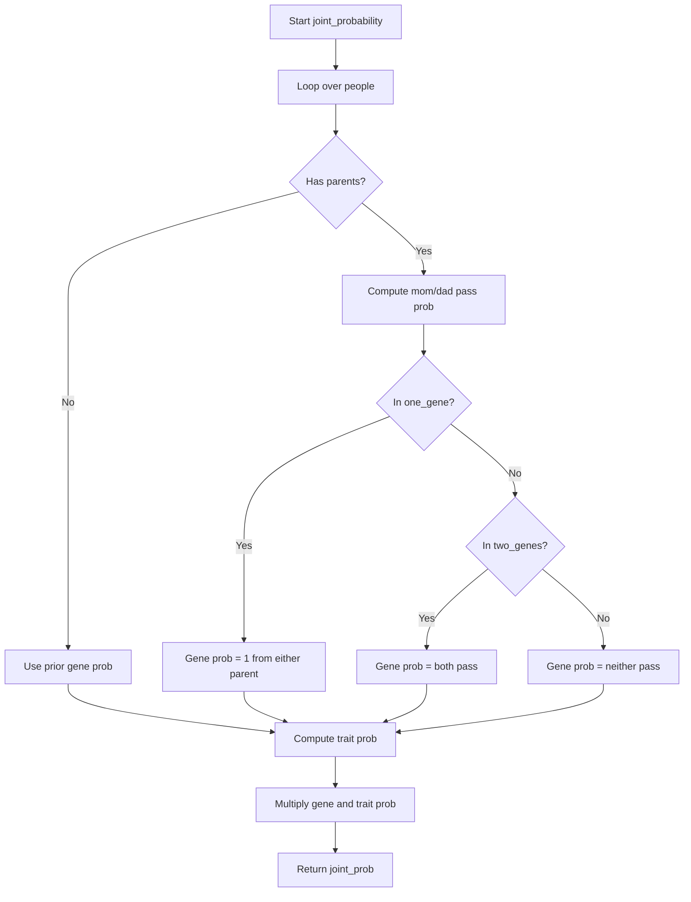

## 序

在学习本课时我感觉概率推理比较难理解，公式看起来也复杂，但通过 heredity 这个作业，我对贝叶斯公式和条件概率的应用有了更直观的体会。


## 背景

`Heredity` 任务模拟了一个简单遗传模型：

- 每个人有 0、1 或 2 个基因拷贝（gene copies）。
- 基因会通过父母传递给孩子，但有一个小的突变概率（mutation）。
  - 拥有0个基因，不遗传给孩子
  - 拥有1个基因，50%概率遗传给孩子
  - 拥有2个基因，遗传一个给孩子
- 拥有不同基因数量的人表现（有 trait）的概率不同。


## 题目分析

任务是让你给定一个家族结构（`people`：每个人和其父母、已知 trait 信息），计算每个人是 0/1/2 个基因与是否表现 trait 的概率分布。

> [!note]
>
> 这部分代码已经实现，`load_data`函数会读取family的csv文件并把家族结构信息存入一个字典`people`

实现方法是对所有可能的“基因分配 + trait 分配”情况进行枚举（穷举），计算每种情况的联合概率，然后累加得到每个人的边缘概率分布。

计算每个人的概率时，需要根据父母基因遗传概率和突变概率。

> [!tip]
>
> 回想一下，要计算多个事件的联合概率，可以通过将这些概率相乘来实现。但请记住，对于任何孩子来说，他们拥有一定数量基因的概率取决于其父母拥有的基因数量，如果没有父母信息，按照PROBS中给出的unconditional probabilities来确定拥有多少个基因的概率，以及表现出trait的概率。


## 函数实现

### 👉joint_probability

`joint_probability(people, one_gene, two_genes, have_trait)`： 计算给定组合(谁是一个基因，谁是两个基因，谁表现出trait)下，这套配置在people库中同时成立的联合概率。

输出结果：

每个人的最终概率分布：

- gene: {0: p, 1: p, 2: p}
- trait: {True: p, False: p}

**核心算法：**

1. 对于`people`中的每个person，先确定person有多少个基因。

   > 看person是在one_gene还是two_genes组里面，或者都没有在。

2. 计算person拥有基因的概率`P(gene)`：

   - 如果person没有父母信息，从代码给出的默认信息PROBS里面获取

   - 如果有父母信息：

     - 先分别获取父母的基因数量，从而可以算出传递基因给孩子的概率

     - 根据person基因的数量n，又可以算出person得到n个基因的概率

       > [!tip]
       >
       > n == 2: 父母分别传了一个，所以`P(gene) = P(mom_pass) * P(dad_pass)`
       >
       > n == 1: 父传母不传，或者母传父不传，也就是`P(gene) = P(dad_pass) * (1 - P(mom_pass)) + P(mom_pass) * (1 - P(dad_pass))`
       >
       > n == 0: 父母都不传，所以是 `P(gene) = (1 -  P(dad_pass)) * (1 -  P(mom_pass))`

3. 计算person的trait概率：
   - 如果person在have_trait的分组里，那么`P(trait) = PROBS["trait"][n][true]`
   - 没有在have_trait的分组里，那么`P(trait) = PROBS["trait"][n][False]`
4. 最后把所有人的所有概率全部相乘，得到最终的联合概率


==流程图：==



### 👉update

`update(probabilities, one_gene, two_genes, have_trait, p)`：该函数将新的联合分布概率添加到中现有的概率分布中`probabilities`。

> 比较简单，把当前组合由joint_probability计算出来的联合概率p，加到probabilities字典里每个人的gene分布和trait分布上

### 👉normalize

`normalize(probabilities)`：把累加后的概率归一化，以保证每个分布概率的和为1.

> 也比较简单，对于每个值，重新计算其在总数里面的比例即可


## 代码实现

```python
import csv
import itertools
import sys

PROBS = {

    # Unconditional probabilities for having gene
    "gene": {
        2: 0.01,
        1: 0.03,
        0: 0.96
    },

    "trait": {

        # Probability of trait given two copies of gene
        2: {
            True: 0.65,
            False: 0.35
        },

        # Probability of trait given one copy of gene
        1: {
            True: 0.56,
            False: 0.44
        },

        # Probability of trait given no gene
        0: {
            True: 0.01,
            False: 0.99
        }
    },

    # Mutation probability
    "mutation": 0.01
}


def main():

    # Check for proper usage
    if len(sys.argv) != 2:
        sys.exit("Usage: python heredity.py data.csv")
    people = load_data(sys.argv[1])

    # Keep track of gene and trait probabilities for each person
    probabilities = {
        person: {
            "gene": {
                2: 0,
                1: 0,
                0: 0
            },
            "trait": {
                True: 0,
                False: 0
            }
        }
        for person in people
    }

    # Loop over all sets of people who might have the trait
    names = set(people)
    for have_trait in powerset(names):

        # Check if current set of people violates known information
        fails_evidence = any(
            (people[person]["trait"] is not None and
             people[person]["trait"] != (person in have_trait))
            for person in names
        )
        if fails_evidence:
            continue

        # Loop over all sets of people who might have the gene
        for one_gene in powerset(names):
            for two_genes in powerset(names - one_gene):

                # Update probabilities with new joint probability
                p = joint_probability(people, one_gene, two_genes, have_trait)
                update(probabilities, one_gene, two_genes, have_trait, p)

    # Ensure probabilities sum to 1
    normalize(probabilities)

    # Print results
    for person in people:
        print(f"{person}:")
        for field in probabilities[person]:
            print(f"  {field.capitalize()}:")
            for value in probabilities[person][field]:
                p = probabilities[person][field][value]
                print(f"    {value}: {p:.4f}")


def load_data(filename):
    """
    Load gene and trait data from a file into a dictionary.
    File assumed to be a CSV containing fields name, mother, father, trait.
    mother, father must both be blank, or both be valid names in the CSV.
    trait should be 0 or 1 if trait is known, blank otherwise.
    """
    data = dict()
    with open(filename) as f:
        reader = csv.DictReader(f)
        for row in reader:
            name = row["name"]
            data[name] = {
                "name": name,
                "mother": row["mother"] or None,
                "father": row["father"] or None,
                "trait": (True if row["trait"] == "1" else
                          False if row["trait"] == "0" else None)
            }
    return data


def powerset(s):
    """
    Return a list of all possible subsets of set s.
    """
    s = list(s)
    return [
        set(s) for s in itertools.chain.from_iterable(
            itertools.combinations(s, r) for r in range(len(s) + 1)
        )
    ]


def joint_probability(people, one_gene, two_genes, have_trait):
    """
    Compute and return a joint probability.

    The probability returned should be the probability that
        * everyone in set `one_gene` has one copy of the gene, and
        * everyone in set `two_genes` has two copies of the gene, and
        * everyone not in `one_gene` or `two_gene` does not have the gene, and
        * everyone in set `have_trait` has the trait, and
        * everyone not in set` have_trait` does not have the trait.
    """
    gene_prob = {}
    trait_prob = {}
    for person in people:
        num_gen_person = get_num_gen(person, one_gene, two_genes)
        # No parents's info, use nnconditional probabilities
        if people[person]["mother"] is None and people[person]["father"] is None:
            gene_prob[person] = PROBS["gene"][num_gen_person]
        # Has parents's info, use conditional probabilities
        else:
            # Get parents name
            mom = people[person]["mother"]
            dad = people[person]["father"]

            # Get probability that each parent might pass gene to their kid based on how many genes they have
            mom_pass_prob = pass_gene_prob(get_num_gen(mom, one_gene, two_genes))
            dad_pass_prob = pass_gene_prob(get_num_gen(dad, one_gene, two_genes))
            
            # Has one gene, either from mom or dad, so probability is:
            # P(mom_pass and dad_not_pass) + P(dad_pass and mom_not_pass)
            if person in one_gene:
                gene_prob[person] = (1 - mom_pass_prob) * dad_pass_prob + \
                    (1 - dad_pass_prob) * mom_pass_prob
            # Has two genes, both mom and dad pass, so probability is:
            # P(mom_pass) * P(dad_pass)
            elif person in two_genes:
                gene_prob[person] = mom_pass_prob * dad_pass_prob
            # Has no gene, neither mon nor dad pass, so probability is:
            # P(mom_not_pass) * P(dad_not_pass)
            else:
                gene_prob[person] = (1 - mom_pass_prob) * (1 - dad_pass_prob)
        
        # Check from PROBS["trait"] according to number of genes and whether has trait
        if person in have_trait:
            trait_prob[person] = PROBS["trait"][num_gen_person][True]
        else:
            trait_prob[person] = PROBS["trait"][num_gen_person][False]
    
    # Calculate joint probability, multiply all probabilities together
    joint_prob = 1
    for person in people:
        joint_prob *= gene_prob[person] * trait_prob[person]
    
    return joint_prob


# Return number of genes a person has
def get_num_gen(person, one_gene, two_genes):
    if person in one_gene:
        return 1
    elif person in two_genes:
        return 2
    else:
        return 0


# Return the probability of a parant passing a gene to their kid
def pass_gene_prob(num_gen):
    # Check num_gen is valid
    if not 0 <= num_gen <= 2:
        raise ValueError("Number of genes must be 0, 1 or 2.")
    # Pass no gene, but might mutate
    if num_gen == 0:
        return PROBS["mutation"]
    # Has one gene, 50% change to pass gene
    elif num_gen == 1:
        return 0.5
    # Has two genes, pass gene but might mutate
    else:
        return 1 - PROBS["mutation"]


def update(probabilities, one_gene, two_genes, have_trait, p):
    """
    Add to `probabilities` a new joint probability `p`.
    Each person should have their "gene" and "trait" distributions updated.
    Which value for each distribution is updated depends on whether
    the person is in `have_gene` and `have_trait`, respectively.
    """
    for person in probabilities:
        num_gene = get_num_gen(person, one_gene, two_genes)
        has_trait = person in have_trait
        probabilities[person]["gene"][num_gene] += p
        probabilities[person]["trait"][has_trait] += p


def normalize(probabilities):
    """
    Update `probabilities` such that each probability distribution
    is normalized (i.e., sums to 1, with relative proportions the same).
    """
    for person in probabilities:
        for field in probabilities[person]:
            total = sum(probabilities[person][field].values())
            if total != 0:
                # Each value divide by total to keep the proportions the same, and sum of probabilities is 1
                for value in probabilities[person][field]:
                    probabilities[person][field][value] /= total 


if __name__ == "__main__":
    main()

```


## 课后思考

代码实现本身不难，难度在于根据作业给出的信息，理解每个函数的功能，并且理解每个概率的算法以及联合概率的概念。

整体感觉是一次很好的训练，体会到了AI在处理不确定性问题时的思维方式，不是追求唯一答案，而是所有可能答案的概率分布。
