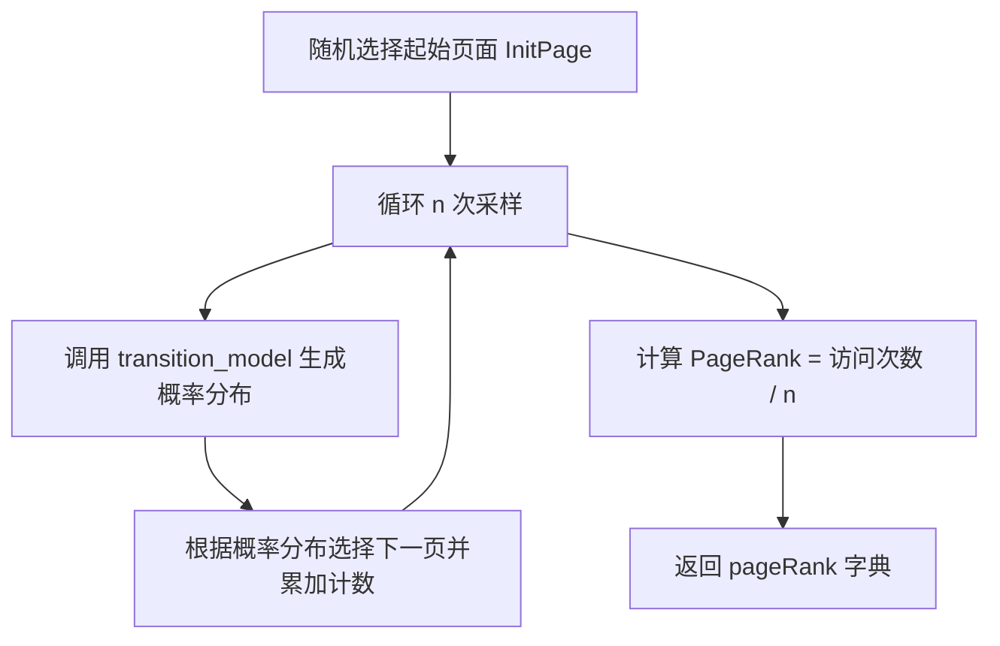
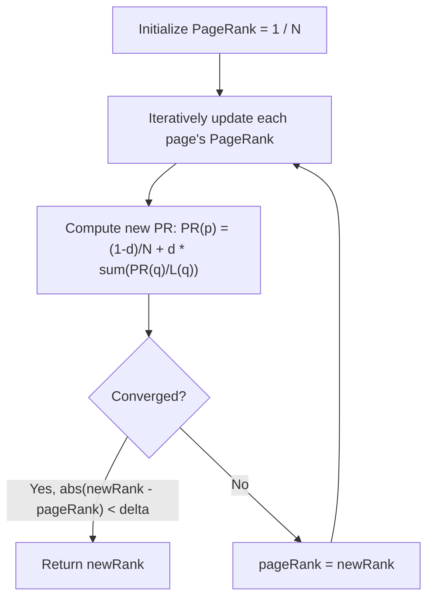

## 序

> 这一课的内容不好理解，涉及概率问题，比较抽象，公式又多。花了好些时间整理笔记，还算把核心的知识点给搞清楚了，但是更深入的一些知识点没有完全掌握。所以开始做课后作业的时候没有太大的信心。没关系，先去做，遇到什么问题再去解决什么问题，


## 题目要求

实现一个类似Google早期搜索算法的核心思想，用于判断网页的重要性。某个网页的重要性不仅取决于访问它的人数，还取决于链接到它的网页的重要性。

- 目标：计算一组网页的pagerank值，这个值可以衡量网页的重要性。
- 输入：一些网页的集合，每个网页里面可能有出链接到其他网页，也可能没有
- 输出：每个网页的pagerank值，来表示一个**随机**访问者浏览到该网页的概率


## 题目分析

既然有的网页没有出链，为了确保我们始终能够访问网页集合中的其他页面，我们将在模型中引入一个阻尼因子`d`。随机浏览者有概率`d`（`d`通常设置为 左右`0.85`）会从当前页面的出链中随机选择一个。但除此之外（概率为`1 - d`），随机浏览者会从网页库的所有页面（包括他们当前所在的页面）中随机选择一个。

> **随机浏览者模型**（Random Surfer Model）：
>
> - 浏览者随机点击网页上的链接。
> - 有概率 `damping_factor` 按网页出链接跳转，每个出链平均分配`damping_factor`。
> - 有概率 `1 - damping_factor` 随机跳转到任何网页。


需要使用抽样法和迭代公式法，计算出每个页面的pagerank


### 转换模型

transition_mode函数应该返回一个字典，该字典表示给定页面集、当前页面和阻尼因子的情况下随机浏览者接下来访问哪个页面的概率分布。

算法参照上述“随机浏览者模型”


### 👉抽样法

> sample_pagerank函数接收3个参数，网页语料库`corpus`, 阻尼因子`damping_factor`和以及样本数量`n`。

**公式**： pagerank = P(page) = 在样本中访问该页面的次数/总样本数

**思路**：

1. 随机选择一个网页作为初始访问页面。
2. 根据transition_model函数多次抽取样本，获取到下一个访问的页面概率分布
3. 我们再把下一个访问的页面概率分布作为权重，随机选择一个页面访问
4. 累加被访问页面的counter
5. 跳转到2继续循环，直至达到样本抽取数量
6. 最终样本抽取完毕，统计每个页面的rank





### 👉迭代公式法

> `iterate_pagerank`函数应接受一个网页语料库`corpus`和一个阻尼因子`damping_factor`，根据迭代公式计算 PageRank，精确到每个页面的 PageRank 误差小于`0.001`后返回。

**公式：**
$$
PR(p) = \frac{1-d}{N} + d \sum_{i \in M(p)} \frac{PR(i)}{NumLinks(i)}
$$

- $d$ = damping factor
- $N$ = 页面总数
- $M(p)$ = 所有指向 $p$ 的页面集合
- $NumLinks(i)$ = 页面 $i$ 的出链数量

> [!caution]
>
> 对于没有出链的页面，假设它链接到所有页面，包括自己。


**算法分析：**

对于页面 $p$，PageRank $PR(p)$ 表示随机浏览者最终停留在 $p$ 的概率。随机浏览者有两种方式到达页面 $p$：

1. 随机跳转到页面$p$
   - 概率为`1- d`
   - 等概率分配到所有的页面:$$\frac{1-d}{N}$$
2. 通过链接从其他页面跳转到$p$
   - 跳转概率为$d$
   - 对于每个连接到$p$的页面$i$：
     - 页面$i$的pagerank为PR($i$)
     - 页面$i$有$NumLinks(i)$个出链
     - 从 $i$ 到 $p$ 的概率 = $\frac{PR(i)}{NumLinks(i)}$




---

## 代码实现

```python
import os
import random
import re
import sys

DAMPING = 0.85
SAMPLES = 10000


def main():
    if len(sys.argv) != 2:
        sys.exit("Usage: python pagerank.py corpus")
    corpus = crawl(sys.argv[1])
    ranks = sample_pagerank(corpus, DAMPING, SAMPLES)
    print(f"PageRank Results from Sampling (n = {SAMPLES})")
    for page in sorted(ranks):
        print(f"  {page}: {ranks[page]:.4f}")
    ranks = iterate_pagerank(corpus, DAMPING)
    print(f"PageRank Results from Iteration")
    for page in sorted(ranks):
        print(f"  {page}: {ranks[page]:.4f}")


def crawl(directory):
    """
    Parse a directory of HTML pages and check for links to other pages.
    Return a dictionary where each key is a page, and values are
    a list of all other pages in the corpus that are linked to by the page.
    """
    pages = dict()

    # Extract all links from HTML files
    for filename in os.listdir(directory):
        if not filename.endswith(".html"):
            continue
        with open(os.path.join(directory, filename)) as f:
            contents = f.read()
            links = re.findall(r"<a\s+(?:[^>]*?)href=\"([^\"]*)\"", contents)
            pages[filename] = set(links) - {filename}

    # Only include links to other pages in the corpus
    for filename in pages:
        pages[filename] = set(
            link for link in pages[filename]
            if link in pages
        )

    return pages


def transition_model(corpus, page, damping_factor):
    """
    Return a probability distribution over which page to visit next,
    given a current page.

    With probability `damping_factor`, choose a link at random
    linked to by `page`. With probability `1 - damping_factor`, choose
    a link at random chosen from all pages in the corpus.
    """
    prob_dist = {}

    # Initialize probability
    for a in corpus:
        prob_dist[a] = (1 - damping_factor) / len(corpus)

    # Probability is evenly distributed among all outgoing pages.
    if corpus[page]:
        for p in corpus[page]:
            prob_dist[p] += damping_factor / len(corpus[page])

    # No outgoing links from the page, pretend it has links to all pages
    else:
        for p in corpus:
            prob_dist[p] += damping_factor / len(corpus)

    return prob_dist


def sample_pagerank(corpus, damping_factor, n):
    """
    Return PageRank values for each page by sampling `n` pages
    according to transition model, starting with a page at random.

    Return a dictionary where keys are page names, and values are
    their estimated PageRank value (a value between 0 and 1). All
    PageRank values should sum to 1.
    """
    # Pick a random page to start
    InitPage = random.choice(list(corpus.keys()))
    page = InitPage
    pageCount = {}
    pageRank = {}

    # Initialize each page's Rank to 0
    for p in corpus:
        pageRank[p] = 0

    for i in range(n):
        # Generate a sample from transition model
        sample = transition_model(corpus, page, damping_factor)
        # Randomly choose a page based on the sample's possibility distribution
        possiblePage = random.choices(list(sample.keys()), list(sample.values()))[0]

        # Accumulate the count of pages visited
        if possiblePage not in pageCount:
            pageCount[possiblePage] = 1
        else:
            pageCount[possiblePage] += 1
        # Move to next page
        page = possiblePage

    # Calaculate page rank according to the visited counter
    for p in pageCount:
        pageRank[p] = pageCount[p] / n
    
    return pageRank


def iterate_pagerank(corpus, damping_factor):
    """
    Return PageRank values for each page by iteratively updating
    PageRank values until convergence.

    Return a dictionary where keys are page names, and values are
    their estimated PageRank value (a value between 0 and 1). All
    PageRank values should sum to 1.
    """
    pageRank = {}
    delta = 0.001

    # Initialize each page rank evenly
    for p in corpus:
        pageRank[p] = 1 / len(corpus)
    
    # PR(p)=(1 − damping_factor)/n + damping_factor * q∈M(p)∑PR(q)/ L(q)
    """e.g. There are 3 pages: A, B, C
    {
     "A.html": {"B.html", "C.html"},
     "B.html": {"C.html"},
     "C.html": {"A.html"}
    }

    PR(A) = ((1 - damping_factor ) / 3) + damping_factor * ((PR(B) / L(B)) + (PR(C) / L(C)))

    L(q) is the number of outgoing links from page q.

    """
    while True:
        newRank = {}
        for p in corpus:
            newRank[p] = (1 - damping_factor) / len(corpus)
            for links in corpus:
                # if a page has no outgoing links, pretend it has links to all pages including itself
                if not corpus[links]:
                    newRank[p] += damping_factor * pageRank[links] / len(corpus)
                # if a page links to p, add rank as the formula
                else:
                    if p in corpus[links]:
                        newRank[p] += damping_factor * pageRank[links] / len(corpus[links])
        
        # If the delta less than threshold 0.001 for all pages, we can stop the loop and return the rank
        if all(abs(newRank[k] - pageRank[k]) < delta for k in newRank):
            return newRank

        pageRank = newRank.copy()


if __name__ == "__main__":
    main()

```


## 课后思考

虽然课程内容涉及的概率论和公式推导比较抽象，刚开始理解时有些吃力，但真正进入代码实现环节时，发现难度并不算高。作业的关键在于**仔细阅读题目要求**，然后根据公式一步步去实现即可。相比编程，理解题目里的模型假设和计算逻辑反而更难。如果一开始没完全读懂要求，很容易走偏。

