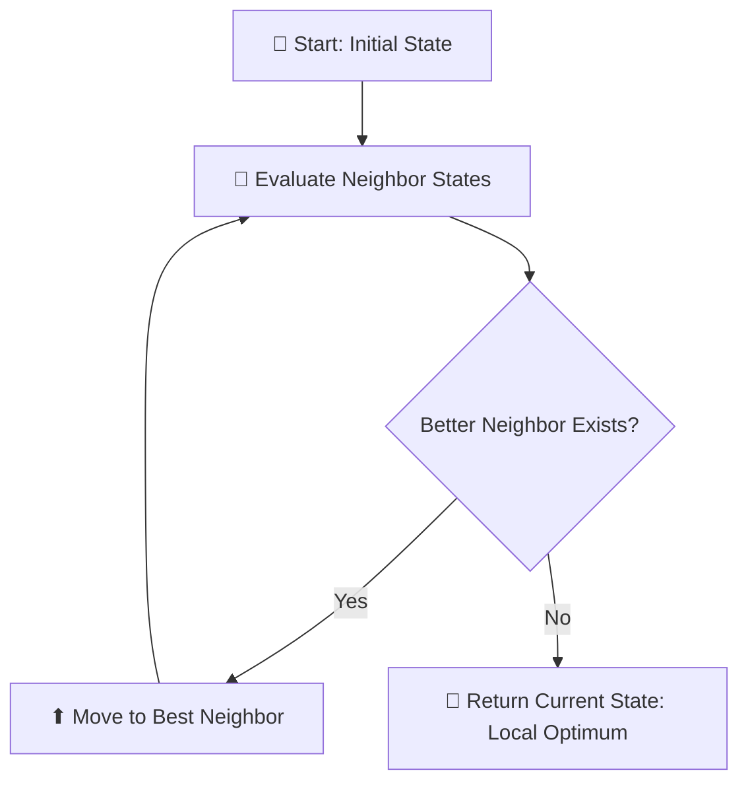
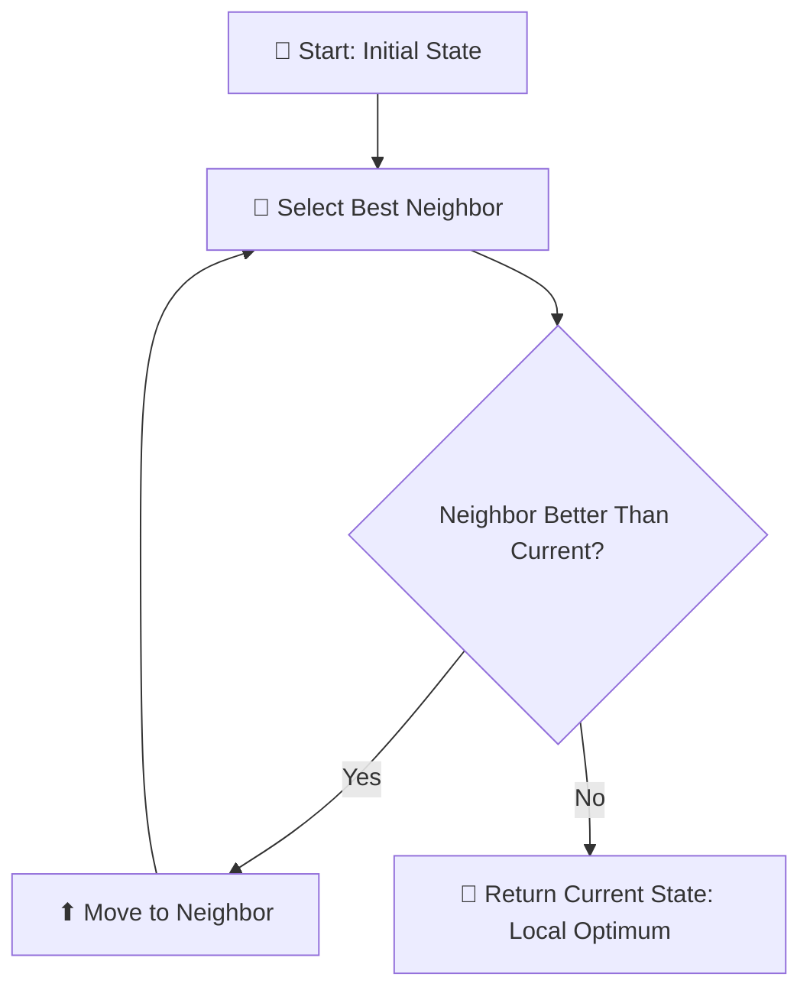
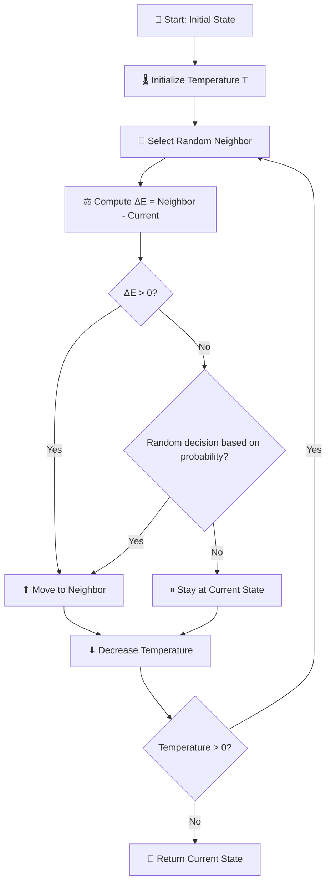

# Optimization

**优化（Optimization）**是从一组可能选项中选择最优方案。
之前在 **minimax 算法** 中已经遇到类似问题，而今天我们将学习更广泛的优化方法。

------

## 📌 1. Local Search（局部搜索）

### 1.1 概念

- 局部搜索维护一个**当前状态**，通过移动到邻近状态来寻找最优解
- 与全局搜索不同（如迷宫求解），局部搜索通常追求“足够好”的解，以节省计算资源

💡 **例子：房子和医院问题**

- 四座房子，建两家医院，使每个房子到最近医院的总距离最小
- **距离计算**：曼哈顿距离（上下左右移动次数）
- **状态**：任意一种房子和医院的配置
- **成本函数**：总距离，需要最小化


### 1.2 基本术语

| 术语                   | 说明                               |
| ---------------------- | ---------------------------------- |
| **Objective Function** | 目标函数，想最大化的量             |
| **Cost Function**      | 成本函数，想最小化的量             |
| **Current State**      | 当前状态                           |
| **Neighbor State**     | 当前状态可转移到的状态（邻居状态） |

> [!note]
>
> 局部搜索算法的工作原理是考虑当前状态下的一个节点，然后将该节点移动到当前状态的邻居节点之一。这与极小极大算法不同，在极小极大算法中，状态空间中的每个状态都是递归考虑的。

### 1.3 流程图



------

## 🧗 2. Hill Climbing（爬山算法）

### 2.1 算法原理

- 比较当前状态的邻居状态，如果存在更优状态，则转移到该邻居
- 终止条件：当前状态比所有邻居都优

💻 **伪代码**：

```
function Hill-Climb(problem):
    current = initial state of problem
    repeat:
        neighbor = best valued neighbor of current
        if neighbor not better than current:
            return current
        current = neighbor
```

### 2.2 局限

- **局部最优**：可能停在局部最小值或最大值，而非全局最优
- **Flat plateau / Shoulder**：平坦区域或肩峰可能导致算法停滞

### 2.3 算法变体

| 变体              | 描述                 |
| ----------------- | -------------------- |
| Steepest-ascent   | 选择最优邻居         |
| Stochastic        | 随机选择更优邻居     |
| First-choice      | 选择第一个更优邻居   |
| Random-restart    | 多次随机开始爬山     |
| Local Beam Search | 使用多个节点进行搜索 |

### 2.4 流程图



------

## ❄️ 3. Simulated Annealing（模拟退火）

### 3.1 原理

- 引入**温度机制**，允许偶尔接受劣解，从而跳出局部最优
- 温度随迭代次数下降，早期易随机跳转，后期趋于稳定

💻 **伪代码**：

```python
function Simulated-Annealing(problem, max):
    current = initial state
    for t = 1 to max:
        T = Temperature(t)
        neighbor = random neighbor of current
        ΔE = neighbor value - current value
        if ΔE > 0:
            current = neighbor
        else:
            with probability e^(ΔE/T):
                current = neighbor
    return current
```

💡 **例子：旅行商问题（TSP）**

> 旅行商问题的任务是连接所有点，并尽可能缩短距离。例如，快递公司需要做的就是找到从商店到所有顾客家并返回的最短路线。

- 10 个点的全排列有 10! 种组合
- 使用模拟退火可以高效找到较优路线

### 3.2 流程图



------

## 📊 4. Linear Programming（线性规划）

### 4.1 概念

> 线性规划是一类优化线性方程（形式为 y = ax₁ + bx₂ + ... 的方程）的问题
>
> 
>
> 

**优化线性方程：**
$$
y = a_1 x_1 + a_2 x_2 + \dots
$$
组成：

- **成本函数**：最小化 $c_1 x_1 + c_2 x_2 + \dots$
- **约束条件**：$\sum a_i x_i \le b$ 或 $= b$
- **变量边界**：$l_i \le x_i \le u_i$

### 4.2 例子

- 两台机器 X₁（50$/小时）、X₂（80$/小时），目标是最小化成本
  - 成本函数：`50x₁ + 80x₂`
- X₁ 每小时需要 5 个劳动单位。X₂ 每小时需要 2 个劳动单位。总共需要 20 个劳动单位
  - 约束条件：`5x₁ + 2x₂ ≤ 20`

- X₁每小时生产10个单位的产出。X₂每小时生产12个单位的产出。公司需要90个单位的产出。

  - 约束条件：`10x₁ + 12x₂ ≥ 90`

    > 约束条件需要写成`(a₁x₁ + a₂x₂ + … + aₙxₙ ≤ b)` 或 `(a₁x₁ + a₂x₂ + … + aₙxₙ = b)`，方便调用python中的scipy库，所以我们乘以(-1)得到`(-10x₁) + (-12x₂) ≤ -90`

💻 **Python 示例**：使用scipy库的线性规划

```python
import scipy.optimize

result = scipy.optimize.linprog(
    [50, 80],           # 成本函数
    A_ub=[[5, 2], [-10, -12]], # 不等式约束
    b_ub=[20, -90]      # 约束上界
)

if result.success:
    print(f"X1: {round(result.x[0],2)} hours")
    print(f"X2: {round(result.x[1],2)} hours")
else:
    print("No solution")
```

------

## 🧩 5. Constraint Satisfaction（约束满足问题, CSP）

### 5.1 概念

> 变量需要取值并满足约束

**组成：**

| 组成         | 说明        |
| :----------- | :---------- |
| 变量集合     | {x₁, x₂, …} |
| 每个变量的域 | {D₁, D₂, …} |
| 约束集合     | C           |

💡 **例子**：

- **Sudoku**：每个空格是变量，取值域 1–9，同行同列数字不同
- **考试排课**：变量是课程，域是日期，约束是同一学生课程不冲突

### 5.2 基本概念

| 术语              | 说明           |
| ----------------- | -------------- |
| Hard Constraint   | 必须满足的约束 |
| Soft Constraint   | 希望满足的约束 |
| Unary Constraint  | 一元约束       |
| Binary Constraint | 二元约束       |

### 5.3 Node Consistency（节点一致性）

> 节点一致性是指变量域中的所有值都满足变量的一元约束

💡 **例子**：
 假设有两门课程 A 和 B。每门课程的域为 {*星期一、星期二、星期三*}，约束为 { *A ≠ 星期一，B ≠ 星期二，B ≠ 星期一，A ≠ B* }。现在，A 和 B 都不具有一致性，因为现有的约束阻止它们取其域中的每个值。但是，如果我们从 A 的域中移除星期一，那么它将具有节点一致性。为了在 B 中实现节点一致性，我们必须从其域中移除星期一和星期二。

### 5.4 Arc Consistency（弧一致性）

> 弧一致性是指变量域中的所有值都满足该变量的二元约束（注意，我们现在使用“弧”来指代之前所说的“边”）。换句话说，==为了使 X 相对于 Y 弧一致，需要从 X 的域中移除元素，直到 X 的每个选择都有 Y 的可能选择==。

考虑我们之前的示例，其域经过修改：A：{*星期二，星期三*} 和 B：{*星期三*}。为了使 A 与 B 弧一致，无论 A 的考试安排在哪一天（从其域中），B 仍然可以安排考试。A 与 B 弧一致吗？如果 A 取值为星期二，则 B 可以取值为星期三。但是，如果 A 取值为星期三，则 B 无法取值（请记住其中一个约束是 A ≠ B）。因此，A 与 B 弧不一致。要改变这种情况，我们可以从 A 的域中删除星期三。然后，A 取的任何值（星期二是唯一的选择）都会为 B 留下一个可取值（星期三）。现在，A 与 B 弧一致。

**Revise 伪代码**：

```
function Revise(csp, X, Y):
    revised = false
    for x in X.domain:
        if no y in Y.domain satisfies constraint:
            delete x from X.domain
            revised = true
    return revised
```

**AC-3 算法**：对所有弧重复 Revise，直到问题弧一致或无解

```python
function AC3(csp):
    queue = all_arcs_in(csp)
    
    while queue:  # queue non-empty
        X, Y = queue.pop(0)  # Dequeue(queue)
        if Revise(csp, X, Y):
            if len(X.domain) == 0:  # size of X.domain == 0
                return False
            for Z in X.neighbors - {Y}:  # each Z in X.neighbors - {Y}
                queue.append((Z, X))  # Enqueue(queue, (Z, X))
    
    return True
```


------

> [!note]
>
> 该算法将问题中的所有弧添加到队列中。每考虑一条弧，就将其从队列中移除。然后，运行“修改”算法来检查这条弧是否一致。如果进行了修改使其一致，则需要采取进一步的措施。如果 X 的结果域为空，则表示该约束满足问题不可解（因为 X 无法取任何值，从而使得 Y 在给定约束的情况下可以取任何值）。如果在上一步中问题未被认定为不可解，那么由于 X 的域已更改，我们需要检查与 X 关联的所有弧是否仍然一致。也就是说，我们选取 X 除 Y 之外的所有邻居，并将它们与 X 之间的弧添加到队列中。但是，如果“修改”算法返回 false，即域未更改，则我们继续考虑其他弧
>
> 💡 **例子**：
>
> W有邻居X，Y和Z。在 **AC-3 算法** 里，**弧（arc）** 是“有方向的约束关系”所以所有涉及W的弧就是{(W, X), (W, Y), (W, Z), (X, W), (Y,W), (Z, W)}。我们每次从这个弧队列里面弹出一对，进行弧一致性检查，如果我们检查(W, X)的时候修改了W，那么W的邻居(除了刚检查过的X)与W的弧应该重新被加入队列，因为W的改变可能影响到邻居对W的弧一致性。
>
> 这里课程没有说明，但是我想到可以**优化**的一个地方。因为每次检查是从弧队列里面弹出一对进行检查，所以检查过的弧不会出现在队列中。那么我们在添加弧的时候，其实可以检查弧是否已经在队列，如果已经存在，是没有必要添加进去的，这样会导致重复检查。
>
> 比如上面的例子：
>
> - (W, X)先做检查，做了修改
> - 添加W邻居与W的弧(刚检查过的X除外)
> - 队列变成{(W, Y), (W, Z), (X, W), (Y,W), (Z, W)，**(Y,W), (Z, W)**}
>
> 可以看到，现在队列里面有两个(Y,W)和(Z, W)，因为它们还没被检查过，还在队列里面，所以完全没有必要再添加一个进去，会被重复检查。优化后的AC-3算法应该是可以避免重复的弧加入队列。
>
> 或者队列改用成set？？

## 🔄 6. Backtracking Search（回溯搜索）

### 6.1 原理

> 回溯搜索是一种考虑约束满足搜索问题结构的搜索算法。通常，它是一个递归函数，只要满足约束条件，就会尝试继续赋值。如果违反了约束条件，则会尝试不同的赋值方式。

💻 **伪代码**：

```
function Backtrack(assignment, csp):
    if assignment complete:
        return assignment
    var = Select-Unassigned-Var(assignment, csp)
    for value in Domain-Values(var, assignment, csp):
        if value consistent with assignment:
            add {var = value} to assignment
            result = Backtrack(assignment, csp)
            if result ≠ failure:
                return result
            remove {var = value} from assignment
    return failure
```

> [!note]
>
> 换句话说，如果当前分配已完成，该算法首先返回当前分配。这意味着，如果算法完成，它将不会执行任何其他操作。相反，它只会返回已完成的分配。如果分配未完成，算法将选择任何尚未分配的变量。然后，算法尝试为变量分配一个值，并对结果分配（递归）再次运行回溯算法。然后，它检查结果值。如果不是*失败*，则表示分配成功，它应该返回此分配。如果结果值为*失败*，则删除最新的分配，并尝试新的可能值，重复相同的过程。如果域中的所有可能值都返回*失败*，则意味着我们需要回溯。也就是说，问题出在某些先前的分配上。如果我们开始的变量发生这种情况，则意味着没有解决方案满足约束。

### 6.2 提升效率的启发式

| 启发式                         | 描述                       |
| ------------------------------ | -------------------------- |
| Minimum Remaining Values (MRV) | 优先分配剩余值最少的变量   |
| Degree Heuristic               | 选择约束最多的变量         |
| Least Constraining Value       | 选择对其他变量约束最少的值 |

### 6.3 Inference（推理）

- 结合 **AC-3**，在每次赋值后保持弧一致，提高搜索效率

------

## ✅ 7. 总结

优化问题的三类处理方法：

| 方法                    | 适用场景                         |
| ----------------------- | -------------------------------- |
| Local Search            | 大状态空间的近似解               |
| Linear Programming      | 线性约束和目标函数优化           |
| Constraint Satisfaction | 复杂约束问题，结合回溯搜索和推理 |

