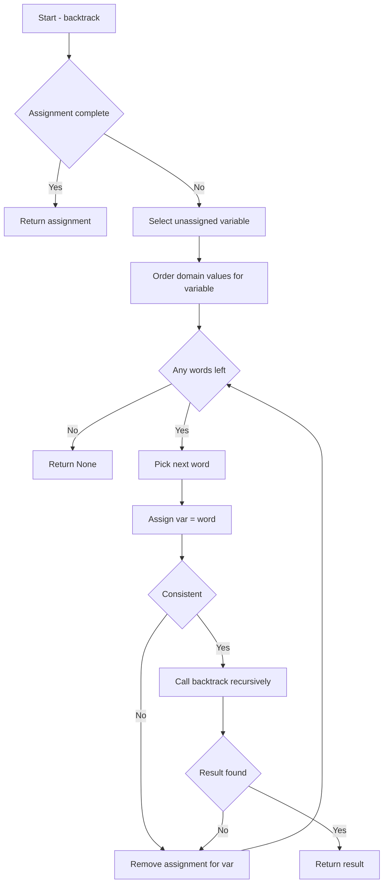

## 序

本次作业的目标是实现一个 **Crossword Solver**，核心思想是将填字游戏建模为 **CSP（Constraint Satisfaction Problem）** 并使用回溯搜索求解。

## 📝1. 问题描述

💡 **Crossword Puzzle**：

给定一个 crossword 网格（黑白方格）, 一些空格组成水平或垂直的单词槽, 每个槽需要从词表中填入合适的单词.

**约束条件**：

- 交叉位置的字母必须相同
- 每个槽长度需与单词匹配

**示例：**

```
Grid:
##############
#######_####_#
#____________#
#_#####_####_#
#_##_____###_#
#_#####_####_#
#_###______#_#
#######_####_#
##############
```

## 🧩2. CSP 模型设计

已经实现了读取structure文件和data文件，从而得到一个初始的`self.domains`，每个Variable对象初始都对应了所有从data文件读取的words。

### 2.1 变量（Variables）

- 每个单词槽对应一个变量，创建一个variable对象，需要提供单词槽开始坐标，方向，以及长度。

- 例：`Variable(0, 1, "ACROSS", 5)`，表示从(0, 1)开始，横向，长度为5个空格

  ​	`Variable(2, 0, "DOWN", 4)`则表示从(2, 0)开始，纵向，长度为4个空格

### 2.2 域（Domains）

> 在 CSP 里我们要维护每个变量的可能取值（即候选单词）。

因此 `self.domains` 是一个字典：

```python
self.domains = {
    Variable(0, 1, "ACROSS", 5): {"APPLE", "GRAPE", "BERRY"},
    Variable(2, 0, "DOWN", 4): {"TREE", "BEAR"},
    ...
}
```

也就是说：

- key = Variable 对象
- value = 这个变量可选的单词集合（set）

> [!important]
>
> 每次 AC-3、revise 或 backtrack 的时候，都会修改这些集合，逐渐缩小候选，直到每个变量只剩下一个单词。

### 2.3 约束（Constraints）

| 类型              | 描述                 | 示例                                    |
| ----------------- | -------------------- | --------------------------------------- |
| Unary Constraint  | 单槽长度匹配单词长度 | Across1 长度 3 → 只能填 3 字单词        |
| Binary Constraint | 交叉位置字母相同     | Across1 第 2 个字母 = Down1 第 1 个字母 |

> [!tip]
>
> 用一个 `overlaps` 字典存储交叉信息：
>
> ```
> overlaps = {
>     ("X", "Y"): (1, 0)  # X第2个字母与Y第1个字母相交
> }
> ```

## 🔄3. 回溯搜索（Backtracking Search）

算法在课程中已经给出，原理在上一篇note里也详细讲述了，代码我给出了详细注释。

### 3.1 算法原理

- 递归分配槽的单词
- 检查每次分配是否满足约束
- 如果冲突 → 回溯

💻 **伪代码**：

```python
function Backtrack(assignment, csp):
    if assignment complete:
        return assignment
    var = Select-Unassigned-Var(assignment, csp)
    for word in Domain(var):
        if word consistent with assignment:
            add {var = word} to assignment
            result = Backtrack(assignment, csp)
            if result != failure:
                return result
            remove {var = word} from assignment
    return failure
```

### 3.2 提升效率的启发式

| 启发式                         | 描述                       |
| ------------------------------ | -------------------------- |
| Minimum Remaining Values (MRV) | 优先分配可能性最少的槽     |
| Degree Heuristic               | 选择约束最多的变量         |
| Least Constraining Value       | 选择对其他槽限制最少的单词 |

💡 **Note**：这些启发式在 crossword 这种交叉约束密集问题中效果显著。

### 3.3 流程图




## 💻4. 代码实现

代码我给出了详细的注释，应该有更优的实现，python还没用熟悉，所以风格比较偏C。

```python
import sys
import random
from crossword import *


class CrosswordCreator():

    def __init__(self, crossword):
        """
        Create new CSP crossword generate.
        """
        self.crossword = crossword
        self.domains = {
            var: self.crossword.words.copy()
            for var in self.crossword.variables
        }

    def letter_grid(self, assignment):
        """
        Return 2D array representing a given assignment.
        """
        letters = [
            [None for _ in range(self.crossword.width)]
            for _ in range(self.crossword.height)
        ]
        for variable, word in assignment.items():
            direction = variable.direction
            for k in range(len(word)):
                i = variable.i + (k if direction == Variable.DOWN else 0)
                j = variable.j + (k if direction == Variable.ACROSS else 0)
                letters[i][j] = word[k]
        return letters

    def print(self, assignment):
        """
        Print crossword assignment to the terminal.
        """
        letters = self.letter_grid(assignment)
        for i in range(self.crossword.height):
            for j in range(self.crossword.width):
                if self.crossword.structure[i][j]:
                    print(letters[i][j] or " ", end="")
                else:
                    print("█", end="")
            print()

    def save(self, assignment, filename):
        """
        Save crossword assignment to an image file.
        """
        from PIL import Image, ImageDraw, ImageFont
        cell_size = 100
        cell_border = 2
        interior_size = cell_size - 2 * cell_border
        letters = self.letter_grid(assignment)

        # Create a blank canvas
        img = Image.new(
            "RGBA",
            (self.crossword.width * cell_size,
             self.crossword.height * cell_size),
            "black"
        )
        font = ImageFont.truetype("assets/fonts/OpenSans-Regular.ttf", 80)
        draw = ImageDraw.Draw(img)

        for i in range(self.crossword.height):
            for j in range(self.crossword.width):

                rect = [
                    (j * cell_size + cell_border,
                     i * cell_size + cell_border),
                    ((j + 1) * cell_size - cell_border,
                     (i + 1) * cell_size - cell_border)
                ]
                if self.crossword.structure[i][j]:
                    draw.rectangle(rect, fill="white")
                    if letters[i][j]:
                        _, _, w, h = draw.textbbox((0, 0), letters[i][j], font=font)
                        draw.text(
                            (rect[0][0] + ((interior_size - w) / 2),
                             rect[0][1] + ((interior_size - h) / 2) - 10),
                            letters[i][j], fill="black", font=font
                        )

        img.save(filename)

    def solve(self):
        """
        Enforce node and arc consistency, and then solve the CSP.
        """
        self.enforce_node_consistency()
        self.ac3()
        return self.backtrack(dict())

    def enforce_node_consistency(self):
        """
        Update `self.domains` such that each variable is node-consistent.
        (Remove any values that are inconsistent with a variable's unary
         constraints; in this case, the length of the word.)
        """
        for var, words in self.domains.items():
            var_len = var.length
            word_len_constr = set()
            for word in words:
                if len(word) == var_len:
                    word_len_constr.add(word)
            self.domains[var] = word_len_constr

    def revise(self, x, y):
        """
        Make variable `x` arc consistent with variable `y`.
        To do so, remove values from `self.domains[x]` for which there is no
        possible corresponding value for `y` in `self.domains[y]`.

        Return True if a revision was made to the domain of `x`; return
        False if no revision was made.
        """
        # find the which cell overlapped in variable x and y 
        overlap = self.crossword.overlaps.get((x, y))
        if overlap is None:
            return False

        overlap_x, overlap_y = overlap

        arc_constr = set()
        for word_x in self.domains[x]:
            for word_y in self.domains[y]:
                # in x we can find at least one arc consistent with y, so keep this word in x
                if word_x[overlap_x] == word_y[overlap_y]:
                    arc_constr.add(word_x)
                    break
        # if removed some words in domains[x], return True, otherwize, return False
        if len(arc_constr) != len(self.domains[x]):
            self.domains[x] = arc_constr
            return True

        return False

    def ac3(self, arcs=None):
        """
        Update `self.domains` such that each variable is arc consistent.
        If `arcs` is None, begin with initial list of all arcs in the problem.
        Otherwise, use `arcs` as the initial list of arcs to make consistent.

        Return True if arc consistency is enforced and no domains are empty;
        return False if one or more domains end up empty.
        """
        if arcs is None:
            arcs = []
            for v in self.crossword.variables:
                neighbors = self.crossword.neighbors(v)
                for x in neighbors:
                    arcs.append((v, x))
        else:
            arcs = list(arcs)
        
        # Create arcs pairs for each variables with their neighbors
        
        # check all of the arcs until there is no update
        while len(arcs) != 0:
            # pop one arc pair and do revise to make variable `x` arc consistent with variable `y`
            x, y = arcs.pop(0)
            if self.revise(x, y):
                # Revised domains[x], removed some words, check if there is no solution in domains[x]
                if len(self.domains[x]) == 0:
                    return False
                # Since we revised x, that might impact others who has arc pairs with x(except y, becasue it just checked)
                # so we need to add a neighbor arc pair with x
                for z in self.crossword.neighbors(x) - {y}:
                    arcs.append((z, x))
        return True

    def assignment_complete(self, assignment):
        """
        Return True if `assignment` is complete (i.e., assigns a value to each
        crossword variable); return False otherwise.
        """
        # Assignment length should equal to number of variables in crossword if assignment is done.
        if len(assignment) != len(self.crossword.variables):
            return False
        
        for v in self.crossword.variables:
            # check variable in assignment and assigned a value
            if v not in assignment or assignment[v] is None:
                return False

        return True

    def consistent(self, assignment):
        """
        Return True if `assignment` is consistent (i.e., words fit in crossword
        puzzle without conflicting characters); return False otherwise.
        """
        for v in assignment:
            # Length of assigned word should match variable length
            if len(assignment[v]) != v.length:
                return False
            neighbors = self.crossword.neighbors(v)
            # check neighbor's assignment, the overlap letter should be the same
            # and the assignment should not be the same as neighbor's
            for n in neighbors:
                if n in assignment:
                    overlap_v, overlap_n = self.crossword.overlaps.get((v, n))
                    if (assignment[v][overlap_v] != assignment[n][overlap_n]
                            or assignment[v] == assignment[n]):
                        return False
        return True

    def order_domain_values(self, var, assignment):
        """
        Return a list of values in the domain of `var`, in order by
        the number of values they rule out for neighboring variables.
        The first value in the list, for example, should be the one
        that rules out the fewest values among the neighbors of `var`.
        """
        ruleout_count = []
        # Set is no order, so we convert to list
        lst_var_domains = list(self.domains[var])
        neighbors = self.crossword.neighbors(var)

        # Iterate over each word in domians[var], and count for each word, how many
        # words in neighbor's domains are ruled out in total
        for index, word in enumerate(lst_var_domains): 
            ruleout_count.append(0)
            for n in neighbors:
                overlap_var, overlap_n = self.crossword.overlaps.get((var, n))
                for value in self.domains[n]:
                    if (n not in assignment and
                            word[overlap_var] != value[overlap_n]):
                        ruleout_count[index] += 1

        # In order to sort the lst_var_domains based on ruleout_count, we zip them together
        weighted_lst = list(zip(lst_var_domains, ruleout_count))
        # Sort based on ruleout_count
        weighted_lst.sort(key=lambda x: x[1])
        # Extract the sorted words
        sorted_lst = [x[0] for x in weighted_lst]
        return sorted_lst

    def select_unassigned_variable(self, assignment):
        """
        Return an unassigned variable not already part of `assignment`.
        Choose the variable with the minimum number of remaining values
        in its domain. If there is a tie, choose the variable with the highest
        degree. If there is a tie, any of the tied variables are acceptable
        return values.
        """
        unassigned_vars = [var for var in self.domains if var not in assignment]
        if not unassigned_vars:
            return None
        
        # Dict to restore {var:remainling_words}
        remaining_values = {var: len(self.domains[var]) for var in unassigned_vars}
        
        # Find min number of remaining words
        min_domain_size = min(remaining_values.values())
        # Get the variables who has the min remaining words
        min_var_domain = [var for var in unassigned_vars if
                          len(self.domains[var]) == min_domain_size]
        # if only one var has the min remianing words, return it.
        if len(min_var_domain) == 1:
            return min_var_domain[0]
        
        # if more than one varibales have the same min remianing words,
        # chech who has a bigger degree(who has more neighbors)
        degree_counts = {var: len(self.crossword.neighbors(var))
                                 for var in min_var_domain}
        
        max_degree = max(degree_counts.values())
        max_degree_var = [var for var in min_var_domain if
                          degree_counts[var] == max_degree]
        # if only one var has the biggest degree, return it
        if len(max_degree_var) == 1:
            return max_degree_var[0]
        # if more, just return one of them randomly
        else:
            return random.choice(max_degree_var)

    def backtrack(self, assignment):
        """
        Using Backtracking Search, take as input a partial assignment for the
        crossword and return a complete assignment if possible to do so.

        `assignment` is a mapping from variables (keys) to words (values).

        If no assignment is possible, return None.
        """
        if self.assignment_complete(assignment):
            return assignment
        
        # get an unssigned variable
        var = self.select_unassigned_variable(assignment)
        words = self.order_domain_values(var, assignment)
        # loop domains[var], words already sorted.
        for word in words:
            # try a new assignment
            assignment[var] = word
            #print(f"Add assignment: {assignment[var]}")
            #self.print(assignment)
            # check if the assignment consistent
            if self.consistent(assignment):
                result = self.backtrack(assignment)
                if result is not None:
                    return result
            # couldn't find a match, delete the assignment
            #print(f"Delete assignment: {assignment[var]}")
            del assignment[var]
            #self.print(assignment)

        return None


def main():

    # Check usage
    if len(sys.argv) not in [3, 4]:
        sys.exit("Usage: python generate.py structure words [output]")

    # Parse command-line arguments
    structure = sys.argv[1]
    words = sys.argv[2]
    output = sys.argv[3] if len(sys.argv) == 4 else None

    # Generate crossword
    crossword = Crossword(structure, words)
    creator = CrosswordCreator(crossword)
    assignment = creator.solve()

    # Print result
    if assignment is None:
        print("No solution.")
    else:
        creator.print(assignment)
        if output:
            creator.save(assignment, output)


if __name__ == "__main__":
    main()

```

## 💡5.  课后思考（Reflection）

这次的Crossword作业给我的感受是：

- **代码量较大**：需要实现的函数比较多，整体结构相对复杂。
- **难度提升明显**：相比之前的作业，这是目前最有挑战性的一次，需要综合运用课堂上学到的多个概念。
- **理解是关键**：一开始看上去比较难，但只要仔细理解课堂内容，并逐步分析每个函数的要求，真正写代码时就不会特别吃力。
- **逻辑性很强**：作业强调如何把 CSP（约束满足问题）的思想真正落实到代码中，从 arc consistency 到 backtracking search，每一步都需要保持清晰的逻辑。
- **调试过程收获大**：在不断测试和修复 bug 的过程中，加深了对“为什么需要一致性检查”、“回溯是如何工作的”等细节的理解。
- **对比之前的作业**：这次不仅仅是写几行算法，而是要把多个小组件组合成一个完整的解题系统，感觉更贴近真实项目开发。

✨ **整体收获**：
 虽然是目前最难的作业，但也因此收获最大。做完之后，不仅加深了对 **CSP、回溯搜索、推理** 的理解，也更有信心去面对更复杂的 AI 问题。
