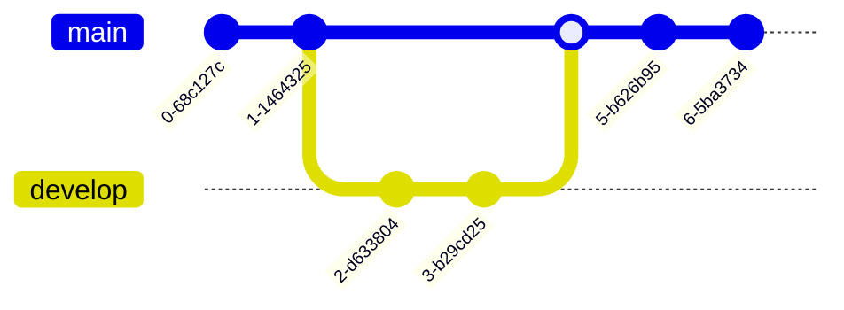

# Draw Diagrams With Markdown

### [Draw Diagrams With Markdown - Typora Support](https://support.typora.io/Draw-Diagrams-With-Markdown/#precondition)


# Precondition

Typora supports some Markdown extensions for diagrams, to use this feature, first **please enable Diagrams in Preferences Panel → Markdown section**.

When exporting as HTML, PDF, epub or docx, those rendered diagrams will also be included, but diagram features are not supported when exporting Markdown into other file formats in the current version. Also, you should note that diagrams are not supported by standard Markdown, CommonMark or GFM. Therefore, we still recommend you to insert an image of these diagrams instead of writing them in Markdown directly.

# Sequence Diagrams

This feature uses [js-sequence](https://bramp.github.io/js-sequence-diagrams/), which turns the following code block into a rendered diagram:

~~~gfm
```sequence
Alice->Bob: Hello Bob, how are you?
Note right of Bob: Bob thinks
Bob-->Alice: I am good thanks!
```
~~~


For more details, please see [this syntax explanation](https://bramp.github.io/js-sequence-diagrams/#syntax).

### Sequence Diagrams Options

You can change the CSS variable `--sequence-theme` to set the theme for sequence diagrams, supported values are `simple` (default) and `hand`. For example, add the following CSS in [Custom CSS](https://support.typora.io/Add-Custom-CSS/), and you will get:

```
:root {
  --sequence-theme: hand
}
```

| –sequence-theme: simple                                      | –sequence-theme: hand                                        |
| ------------------------------------------------------------ | ------------------------------------------------------------ |
|  |  |

# Flowcharts

This feature uses [flowchart.js](http://flowchart.js.org/), which turns the following code block into a rendered diagram:

~~~gfm
```flow
st=>start: Start
op=>operation: Your Operation
cond=>condition: Yes or No?
e=>end

st->op->cond
cond(yes)->e
cond(no)->op
```
~~~


# Mermaid

Typora also has integration with [mermaid](https://mermaid-js.github.io/mermaid/#/), which supports sequence diagrams, flowcharts, Gantt charts, class and state diagrams, and pie charts.

## Sequence Diagrams

For more details see [these instructions](https://mermaid.js.org/syntax/sequenceDiagram.html).

~~~gfm

~~~


## Flowcharts

For more details see [these instructions](https://mermaid.js.org/syntax/flowchart.html).

~~~gfm

~~~


## Gantt Charts

For more details see [these instructions](https://mermaid.js.org/syntax/gantt.html).

~~~gfm

~~~


## Class Diagrams

For more details see [these instructions](https://mermaid.js.org/syntax/classDiagram.html).

~~~gfm

~~~


## State Diagrams

For more details see [these instructions](https://mermaid.js.org/syntax/stateDiagram.html).

~~~gfm

~~~


## Pie Charts

~~~gfm

~~~


## Requirement Diagram

A Requirement diagram provides a visualization for requirements and their connections, to each other and other documented elements. The modeling specs follow those defined by SysML v1.6.

You can find details [here](https://mermaid-js.github.io/mermaid/#/requirementDiagram).

````

````


## Gitgraph Diagrams / Commit Flow

A Git Graph is a pictorial representation of git commits and git actions(commands) on various branches.

You can find details [here](https://mermaid.js.org/syntax/gitgraph.html).

````

````


## C4 Diagrams (plantUML compatible)

Mermaid’s c4 diagram syntax is compatible with plantUML.

You can find details [here](https://mermaid.js.org/syntax/c4c.html).

## Mindmap

A mind map is a diagram used to visually organize information into a hierarchy, showing relationships among pieces of the whole. It is often created around a single concept, drawn as an image in the center of a blank page, to which associated representations of ideas such as images, words and parts of words are added. Major ideas are connected directly to the central concept, and other ideas branch out from those major ideas.

You can find details [here](https://mermaid.js.org/syntax/mindmap.html).

~~~gfm

~~~


## Timeline

See https://mermaid.js.org/syntax/timeline.html for detail.


## Quadrant Chart

See https://mermaid.js.org/syntax/quadrantChart.html for details.


## Sankey diagrams

See https://mermaid.js.org/syntax/sankey.html for details.


## ZenUML

See https://mermaid.js.org/syntax/zenuml.html for details.


Please notice that zenuml is not first class diagram in mermaid, it may lack some features, like dark themes, etc.

## XY Chart

You can find more details here → https://mermaid.js.org/syntax/xyChart.html.

You can now draw charts like this:


## Global Mermaid Options

### Overview

You can change Mermaid options by adding [Custom CSS](https://support.typora.io/Add-Custom-CSS/), supported options include:

```
:root {
  --mermaid-theme: default; /*or base, dark, forest, neutral, night */
  --mermaid-font-family: "trebuchet ms", verdana, arial, sans-serif;
  --mermaid-sequence-numbers: off; /* or "on", see https://mermaid-js.github.io/mermaid/#/sequenceDiagram?id=sequencenumbers*/
  --mermaid-flowchart-curve: linear /* or "basis", see https://github.com/typora/typora-issues/issues/1632*/;
  --mermaid--gantt-left-padding: 75; /* see https://github.com/typora/typora-issues/issues/1665*/
}
```

Please note that if you export a document with themes other than the currently used one, some mermaid options will not be applied to exported HTML / PDF / Images. For example, if you currently use the Github theme, then export to PDF using the theme YYY and YYY.css defines `--mermaid-sequence-numbers: on`, then the `--mermaid-sequence-numbers: on` would not be applied to the exported PDF.

### Diagram Alignment

You can add the custom CSS below by following [Add Custom CSS](https://support.typora.io/Add-Custom-CSS/) to left align your diagram.

```
.md-diagram-panel-preview {text-align:left;}
```

### Mermaid Theme

The `--mermaid-theme` css variable can quickly define a mermaid theme that fits your theme, the value can be `base`, `default`, `dark`, `forest`, `neutral` or `night` (the one used in night theme), for example:

| CSS                                | Mermaid Demo                                                 |
| ---------------------------------- | ------------------------------------------------------------ |
| `:root {--mermaid-theme:dark;}`    |  |
| `:root {--mermaid-theme:neutral;}` |  |
| `:root {--mermaid-theme:forest;}`  |  |

### Auto Numbering

Adding `--mermaid-sequence-numbers: on;` in the [Custom CSS](https://support.typora.io/Add-Custom-CSS/) will enable auto numbering for sequences in mermaid:

| –mermaid-sequence-numbers:off                                | –mermaid-sequence-numbers:on                                 |
| ------------------------------------------------------------ | ------------------------------------------------------------ |
|  |  |

### Flowchart Curve

Add `--mermaid-flowchart-curve: basis` to get other type of curves.

| –mermaid-flowchart-curve: linear;                            | –mermaid-flowchart-curve: basis                              | –mermaid-flowchart-curve: natural;                           | –mermaid-flowchart-curve: step;                              |
| ------------------------------------------------------------ | ------------------------------------------------------------ | ------------------------------------------------------------ | ------------------------------------------------------------ |
|  |  |  |  |

### Gantt Padding

| –mermaid–gantt-left-padding:75                               | –mermaid–gantt-left-padding:200                              |
| ------------------------------------------------------------ | ------------------------------------------------------------ |
|  |  |

## Inline Mermaid Config

You can add `%%{init: [options]}%%` to the first line of your mermaid diagram to configure mermaid details as shown below:


You can find full documentation at [Draw Diagrams With Markdown - Typora Support](https://support.typora.io/Draw-Diagrams-With-Markdown/#precondition)