[TOC]


# 一级标题

## 二级标题

wefje

wekfjew

---

### fejlwjef

**粗体**

~~删除线~~

<u>下划线</u>

*斜体*

==高亮==

x^2^

H~2~O

- [ ] lunch

- [ ] wfjwjfjj

>
>
>wefwew
>
>wefwe
>
>>
>>
>>wefwefe
>>
>>>
>>>
>>>wfejwef

```python
wefwejflflwef `int a=0;`wefef
```


www.baidu.com

[baidu](https://www.baidu.com)


| efw  | fwf  | ffw  |
| ---- | ---- | ---- |
|      |      |      |
|      |      |      |
|      |      |      |

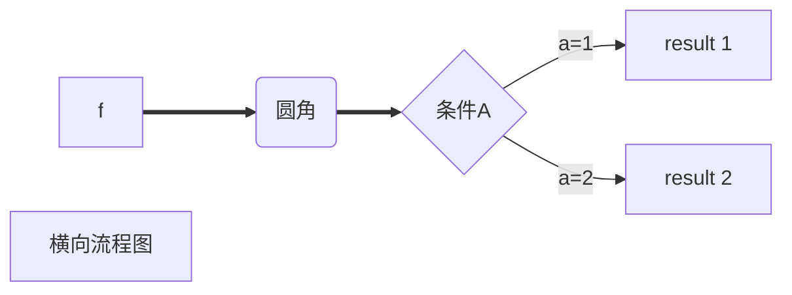

```sequence
Alice->B: hello, how are you
Note right of B: B thanks
B->Alice: I'm good.
```

```flow

```

```js

```

$$
wwlkefwf
$$

$ gongshi$


H~2~O

x^2^

${a\over b}$

$\sqrt[2]{3}$

$\Alpha$

$\beta$

$\Downarrow$

$\color{lime}{color}$

<kbd>内容</kbd>


```flow
st=>start: Start
op=>operation: Your Operation
cond=>condition: Yes or No?
e=>end

st->op->cond
cond(yes)->e
cond(no)->op
```


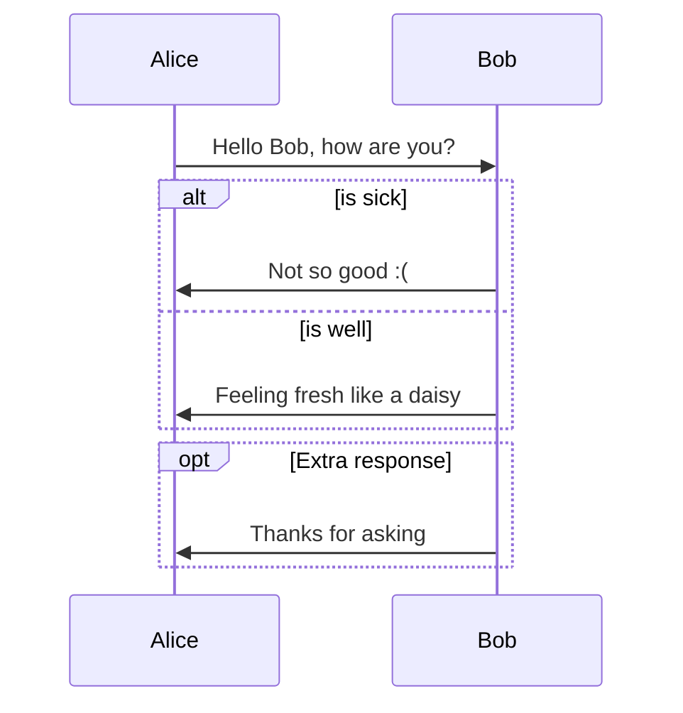

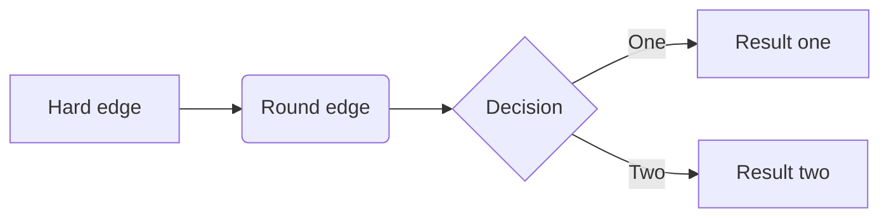

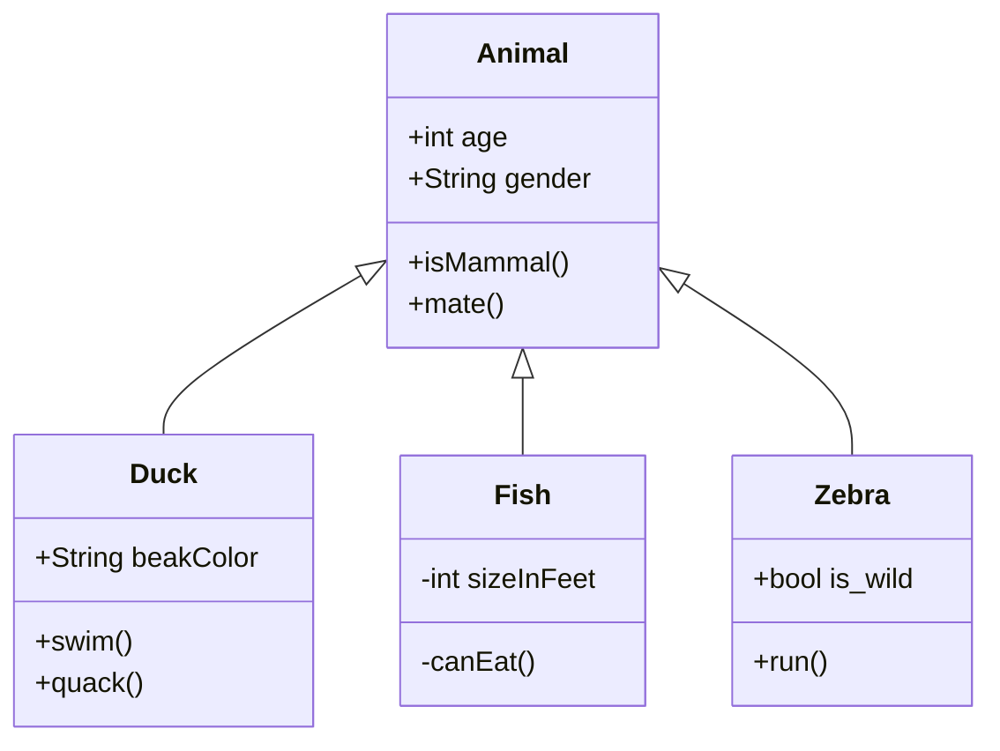

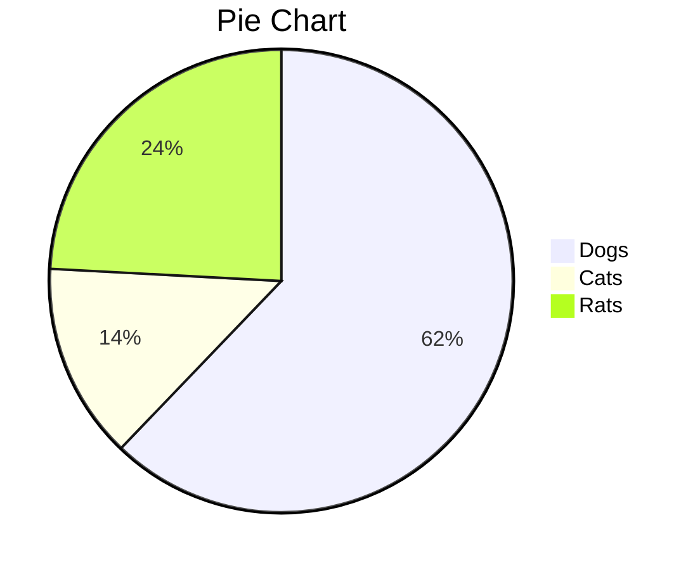


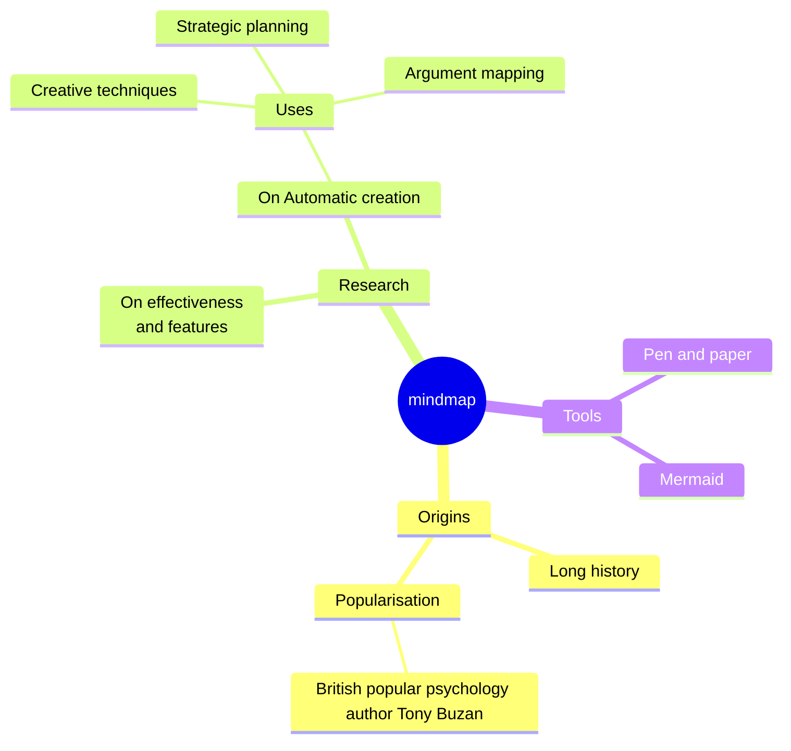

zenuml    title Demo    Alice->John: Hello John, how are you?    John->Alice: Great!    Alice->John: See you later!

```zenuml
    title Demo
    Alice->John: Hello John, how are you?
    John->Alice: Great!
    Alice->John: See you later!
```


```mermaidzenuml
    title Demo
    Alice->John: Hello John, how are you?
    John->Alice: Great!
    Alice->John: See you later!
```

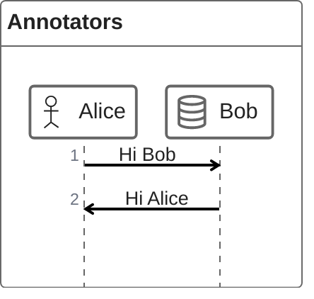


***


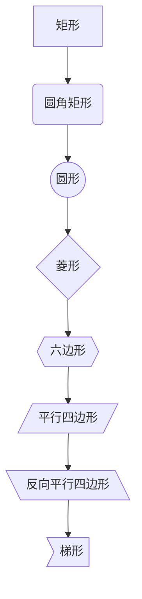


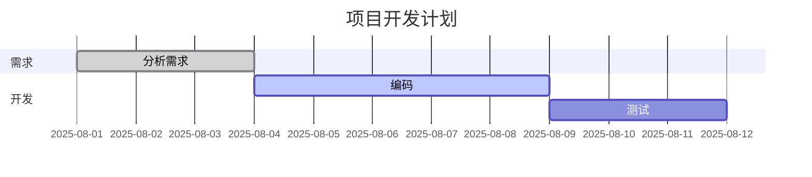

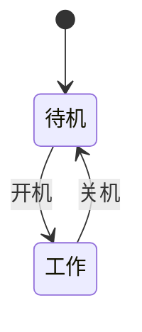

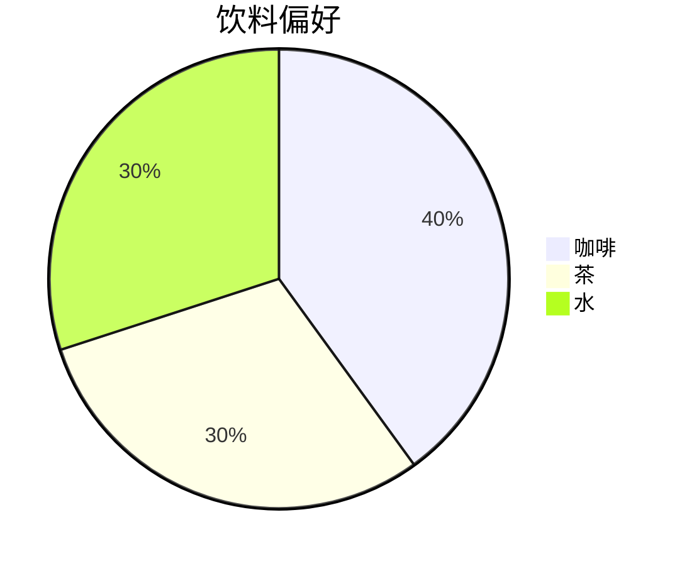

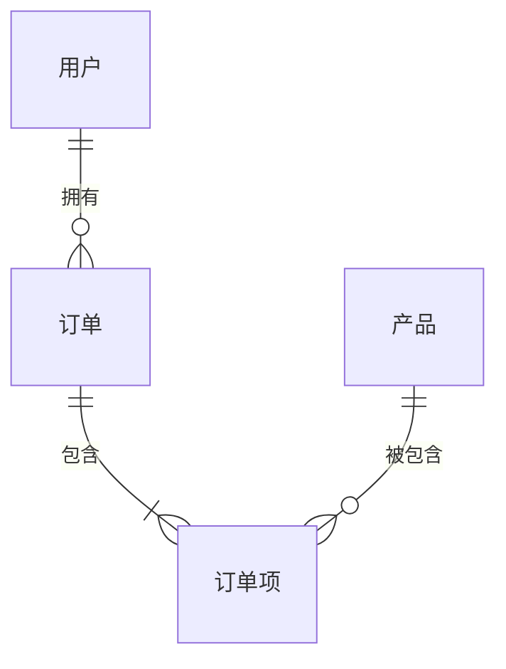

